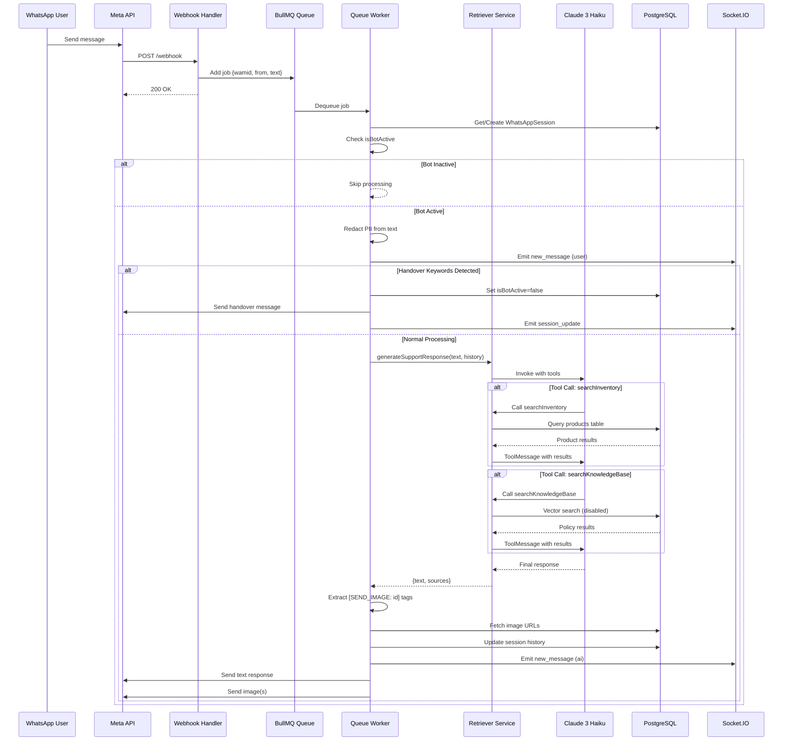

# AI System Architecture

The KAIU AI system is built on a queue-based architecture using BullMQ for reliable message processing, Claude 3 Haiku for conversational AI, and pgvector for semantic search.

## System Flow



## Core Components

### 1. Queue Worker (`queue.js:35-211`)

The BullMQ worker processes WhatsApp messages asynchronously:

```javascript
export const worker = new Worker('whatsapp-ai', async job => {
    const { wamid, from, text } = job.data;
    
    // Session management
    let session = await prisma.whatsAppSession.findUnique({ where: { phoneNumber: from } });
    
    if (!session.isBotActive) {
        console.log(`⏸️ Bot inactive for ${from}. Skipping.`);
        return;
    }
    
    // PII redaction
    const cleanText = redactPII(text);
    
    // Handover check
    const HANDOVER_KEYWORDS = /\b(humano|agente|asesor|persona|queja|reclamo|ayuda|contactar|hablar con alguien)\b/i;
    if (HANDOVER_KEYWORDS.test(text)) {
        // Disable bot and notify
    }
    
    // AI processing
    const aiResponse = await generateSupportResponse(text, history);
    
    // Image extraction and sending
}, { 
    connection: workerConnection,
    limiter: { max: 10, duration: 1000 }
});
```

### 2. Retriever Service (`Retriever.js:119-200`)

Orchestrates Claude API calls with tool use:

```javascript
export async function generateSupportResponse(userQuestion, chatHistory = []) {
    // Truncate to last 4 messages to prevent hallucinations
    const recentHistory = chatHistory.slice(-4);
    
    // Anti-hallucination hook for images
    let finalUserQuestion = userQuestion;
    if (/(foto|imagen|imágen|ver|mostrar)/i.test(finalUserQuestion)) {
        finalUserQuestion += "\n[SISTEMA: Obligatorio ejecutar searchInventory ahora mismo para obtener los IDs reales (UUID) de las imágenes. NO inventes IDs aleatorios.]";
    }
    
    const messages = [
        new SystemMessage(systemPrompt),
        ...chatLog,
        new HumanMessage(finalUserQuestion)
    ];
    
    const modelWithTools = getChatModel().bindTools(tools);
    
    // Initial invocation
    let aiMessage = await modelWithTools.invoke(messages);
    
    // Process tool calls
    if (aiMessage.tool_calls && aiMessage.tool_calls.length > 0) {
        messages.push(aiMessage);
        
        for (const toolCall of aiMessage.tool_calls) {
            let toolResultStr = "";
            if (toolCall.name === "searchInventory") {
                toolResultStr = await executeSearchInventory(toolCall.args.query);
            } else if (toolCall.name === "searchKnowledgeBase") {
                toolResultStr = await executeSearchKnowledgeBase(toolCall.args.query);
            }
            
            messages.push(new ToolMessage({
                tool_call_id: toolCall.id,
                content: toolResultStr,
                name: toolCall.name
            }));
        }
        
        // Second invocation with tool results
        aiMessage = await modelWithTools.invoke(messages);
    }
    
    return { text: aiMessage.content + "\n\n_🤖 Asistente Virtual KAIU_", sources: [] };
}
```

### 3. Claude Client (`Retriever.js:25-37`)

Singleton instance with lazy loading:

```javascript
let chatModel = null;

function getChatModel() {
    if (!chatModel) {
        chatModel = new ChatAnthropic({
            modelName: "claude-3-haiku-20240307", // Fast & Cheap
            temperature: 0.1, // Low temp for tool calling reliability
            anthropicApiKey: process.env.ANTHROPIC_API_KEY,
        });
    }
    return chatModel;
}
```

## Database Schema

### WhatsAppSession Model

```prisma
model WhatsAppSession {
  id              String   @id @default(uuid())
  phoneNumber     String   @unique
  isBotActive     Boolean  @default(true)
  sessionContext  Json?    // { history: [{role, content}] }
  handoverTrigger String?  // Reason for escalation
  expiresAt       DateTime // 24h Meta window
  userId          String?  @unique
  user            User?    @relation(fields: [userId], references: [id])
  createdAt       DateTime @default(now())
  updatedAt       DateTime @updatedAt
}
```

### KnowledgeBase Model

```prisma
model KnowledgeBase {
  id        String   @id @default(uuid())
  content   String   @db.Text
  metadata  Json?    // { source, id, title, type }
  embedding Unsupported("vector(1536)")? // pgvector
  createdAt DateTime @default(now())
}
```

## Memory Optimization

<Warning>
  **Free Tier OOM Protection**: The embedding pipeline is bypassed on Render free tier to save 300MB RAM.
</Warning>

```javascript
async function getEmbeddingPipe() {
    if (!embeddingPipe) {
        console.log("🔌 Loading Embedding Model (BYPASSED FOR RENDER FREE TIER OOM PROTECTION)...");
        // Bypass transformer load to save RAM
        embeddingPipe = () => { return { toList: () => new Array(1536).fill(0.0) } };
    }
    return embeddingPipe;
}
```

For production, use a real embedding model like:
- `@xenova/transformers` with `Xenova/all-MiniLM-L6-v2`
- OpenAI `text-embedding-3-small`
- Cohere `embed-multilingual-v3.0`

## Performance Tuning

### BullMQ Limiter (`queue.js:204-206`)

```javascript
limiter: {
    max: 10, // Max 10 concurrent jobs
    duration: 1000 // Per second
}
```

### History Truncation (`Retriever.js:125`)

```javascript
const recentHistory = chatHistory.slice(-4); // Last 4 messages only
```

Prevents tool hallucinations by forcing fresh database queries instead of relying on stale context.

### Message Limit (`queue.js:83`)

```javascript
if (history.length > 10) history = history.slice(-10);
```

Keeps session storage minimal and prevents context window overflow.

## Error Handling

```javascript
try {
    const aiResponse = await generateSupportResponse(text, history);
} catch (error) {
    console.error("❌ Error in Agent Service:", error);
    return { text: "Lo siento, tuve un error interno procesando tu consulta. Por favor intenta más tarde." };
}
```

## Next Steps

<CardGroup cols={2}>
  <Card title="RAG System" icon="database" href="/ai/rag-system">
    Dive into vector search implementation
  </Card>
  <Card title="Tools & Functions" icon="wrench" href="/ai/tools-functions">
    Learn about searchInventory and searchKnowledgeBase
  </Card>
</CardGroup>