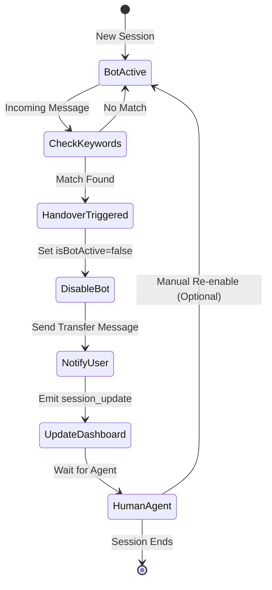

# Human Handover Protocol

KAIU's AI system automatically detects when a customer needs human assistance and seamlessly transfers the conversation to a live agent. This ensures complex issues, complaints, or explicit requests for human support are handled appropriately.

## Handover Flow



## Keyword Detection

### Implementation (`queue.js:86-116`)

```javascript
// --- HANDOVER CHECK ---
const HANDOVER_KEYWORDS = /\b(humano|agente|asesor|persona|queja|reclamo|ayuda|contactar|hablar con alguien)\b/i;

if (HANDOVER_KEYWORDS.test(text)) {
    console.log(`🚨 Handover triggered for ${from} by text: "${text}"`);
    
    // 1. Disable Bot
    await prisma.whatsAppSession.update({
        where: { id: session.id },
        data: { 
            isBotActive: false,
            handoverTrigger: "KEYWORD_DETECTED",
            sessionContext: { ...session.sessionContext, history } // Save history including trigger msg
        }
    });

    // Emit Status Update
    if (io) io.emit('session_update', { id: session.id, status: 'handover' });

    // 2. Send "Connect to Agent" Message
    await axios.post(
        `https://graph.facebook.com/v21.0/${process.env.WHATSAPP_PHONE_ID}/messages`,
        {
            messaging_product: "whatsapp",
            to: from,
            text: { body: "Te estoy transfiriendo con un asesor humano. Un momento por favor." }
        },
        { headers: { 
            'Authorization': `Bearer ${process.env.WHATSAPP_ACCESS_TOKEN}`, 
            'Content-Type': 'application/json' 
        }}
    );
    
    console.log(`✅ Handover executed for ${from}`);
    return; // STOP AI PROCESSING
}
```

## Trigger Keywords

The system detects these Spanish keywords (case-insensitive):

| Category | Keywords |
|----------|----------|
| **Human Request** | `humano`, `agente`, `asesor`, `persona` |
| **Complaints** | `queja`, `reclamo` |
| **Help Requests** | `ayuda`, `contactar` |
| **Phrases** | `hablar con alguien` |

<Tip>
  The regex uses **word boundaries** (`\b`) to prevent false positives from partial matches like "humanoid" or "agencia".
</Tip>

## Example Conversations

<CodeGroup>
```txt Explicit Request
User: "Quiero hablar con un agente humano"

→ HANDOVER TRIGGERED
→ Bot disabled
→ Response: "Te estoy transfiriendo con un asesor humano. Un momento por favor."
```

```txt Complaint
User: "Tengo una queja sobre mi pedido"

→ HANDOVER TRIGGERED
→ Bot disabled
→ Response: "Te estoy transfiriendo con un asesor humano. Un momento por favor."
```

```txt Help Request
User: "Necesito ayuda urgente"

→ HANDOVER TRIGGERED
→ Bot disabled
→ Response: "Te estoy transfiriendo con un asesor humano. Un momento por favor."
```

```txt No Match
User: "¿Tienen aceite de lavanda?"

→ NO HANDOVER
→ Bot processes normally with searchInventory tool
```
</CodeGroup>

## Database State

### WhatsAppSession Model

```prisma
model WhatsAppSession {
  id              String   @id @default(uuid())
  phoneNumber     String   @unique
  isBotActive     Boolean  @default(true)  // Set to false on handover
  sessionContext  Json?    // Preserves conversation history
  handoverTrigger String?  // "KEYWORD_DETECTED" | "MANUAL" | "TIMEOUT"
  expiresAt       DateTime
  userId          String?  @unique
  user            User?    @relation(fields: [userId], references: [id])
  createdAt       DateTime @default(now())
  updatedAt       DateTime @updatedAt
}
```

### State Transitions

| Field | Before Handover | After Handover |
|-------|----------------|----------------|
| `isBotActive` | `true` | `false` |
| `handoverTrigger` | `null` | `"KEYWORD_DETECTED"` |
| `sessionContext.history` | Array of messages | Preserved (includes trigger) |

## Real-time Dashboard Updates

### Socket.IO Events (`queue.js:101`)

```javascript
if (io) {
    io.emit('session_update', { 
        id: session.id, 
        status: 'handover' 
    });
}
```

The admin dashboard receives this event and:
1. Highlights the session in the sidebar
2. Shows a red "Handover" badge
3. Plays an optional alert sound
4. Opens the conversation for agent response

## Bot Deactivation Behavior

### Incoming Messages After Handover (`queue.js:56-59`)

```javascript
if (!session.isBotActive) {
    console.log(`⏸️ Bot inactive for ${from}. Skipping.`);
    return; // Job completes without AI processing
}
```

Once `isBotActive` is set to `false`:
- Messages are still received and stored
- No AI processing occurs
- Agent dashboard shows all messages
- Agent can respond manually via dashboard

<Warning>
  The bot will NOT automatically re-activate. An admin must manually re-enable it via the dashboard or API.
</Warning>

## Manual Re-activation

To re-enable the bot after resolution:

```javascript
// Admin API endpoint
await prisma.whatsAppSession.update({
    where: { id: sessionId },
    data: { 
        isBotActive: true,
        handoverTrigger: null
    }
});
```

## Handover Message Customization

Edit the transfer message in `queue.js:109`:

```javascript
await axios.post(
    `https://graph.facebook.com/v21.0/${process.env.WHATSAPP_PHONE_ID}/messages`,
    {
        messaging_product: "whatsapp",
        to: from,
        text: { 
            body: "Te estoy transfiriendo con un asesor humano. Un momento por favor." 
        }
    },
    { headers: { 
        'Authorization': `Bearer ${process.env.WHATSAPP_ACCESS_TOKEN}`, 
        'Content-Type': 'application/json' 
    }}
);
```

## Adding Custom Keywords

### English Support

```javascript
const HANDOVER_KEYWORDS = /\b(humano|agente|asesor|persona|queja|reclamo|ayuda|contactar|hablar con alguien|human|agent|help|support|speak to someone)\b/i;
```

### Category-Specific Triggers

```javascript
const URGENT_KEYWORDS = /\b(urgente|emergencia|critico)\b/i;
const COMPLAINT_KEYWORDS = /\b(queja|reclamo|insatisfecho|devolucion)\b/i;

if (URGENT_KEYWORDS.test(text)) {
    handoverTrigger = "URGENT_DETECTED";
} else if (COMPLAINT_KEYWORDS.test(text)) {
    handoverTrigger = "COMPLAINT_DETECTED";
} else if (HANDOVER_KEYWORDS.test(text)) {
    handoverTrigger = "KEYWORD_DETECTED";
}
```

## Advanced: Sentiment-Based Handover

For production, consider adding sentiment analysis:

```javascript
import Sentiment from 'sentiment';

const sentiment = new Sentiment();
const result = sentiment.analyze(text);

if (result.score < -3) {
    // Very negative sentiment
    console.log(`🚨 Negative sentiment detected: ${result.score}`);
    handoverTrigger = "NEGATIVE_SENTIMENT";
    // Trigger handover
}
```

## Conversation History Preservation

The full conversation history is preserved on handover:

```javascript
await prisma.whatsAppSession.update({
    where: { id: session.id },
    data: { 
        isBotActive: false,
        handoverTrigger: "KEYWORD_DETECTED",
        sessionContext: { 
            ...session.sessionContext, 
            history // Includes the trigger message
        } 
    }
});
```

This allows the human agent to:
- See the full context
- Understand why handover was triggered
- Continue the conversation seamlessly

## Handover Analytics

Track handover metrics:

```sql
-- Count handovers by trigger
SELECT 
    "handoverTrigger", 
    COUNT(*) as count,
    AVG(EXTRACT(EPOCH FROM ("updatedAt" - "createdAt"))) as avg_duration_seconds
FROM whatsapp_sessions
WHERE "handoverTrigger" IS NOT NULL
GROUP BY "handoverTrigger"
ORDER BY count DESC;
```

## Best Practices

<CardGroup cols={2}>
  <Card title="Preserve Context" icon="history">
    Always save conversation history on handover so agents have full context
  </Card>
  <Card title="Immediate Response" icon="bolt">
    Send transfer message instantly to acknowledge the handover request
  </Card>
  <Card title="Clear Keywords" icon="list-check">
    Use unambiguous keywords to prevent false positives
  </Card>
  <Card title="Alert Agents" icon="bell">
    Use real-time notifications to ensure agents see handover requests
  </Card>
</CardGroup>

## Testing Handovers

```javascript
// Test messages
const testCases = [
    "Quiero hablar con un agente", // Should trigger
    "Tengo una queja",             // Should trigger
    "Necesito ayuda con mi pedido", // Should trigger
    "¿Tienen lavanda?",             // Should NOT trigger
    "Esto es una humanidad"         // Should NOT trigger (partial match)
];

for (const text of testCases) {
    const matches = HANDOVER_KEYWORDS.test(text);
    console.log(`"${text}" → ${matches ? 'HANDOVER' : 'NORMAL'}`);
}
```

## Next Steps

<CardGroup cols={2}>
  <Card title="Dashboard Integration" icon="desktop" href="/admin/whatsapp-dashboard">
    Learn how agents receive handover notifications
  </Card>
  <Card title="PII Privacy" icon="shield" href="/ai/pii-privacy">
    Understand how sensitive data is protected during handovers
  </Card>
</CardGroup>