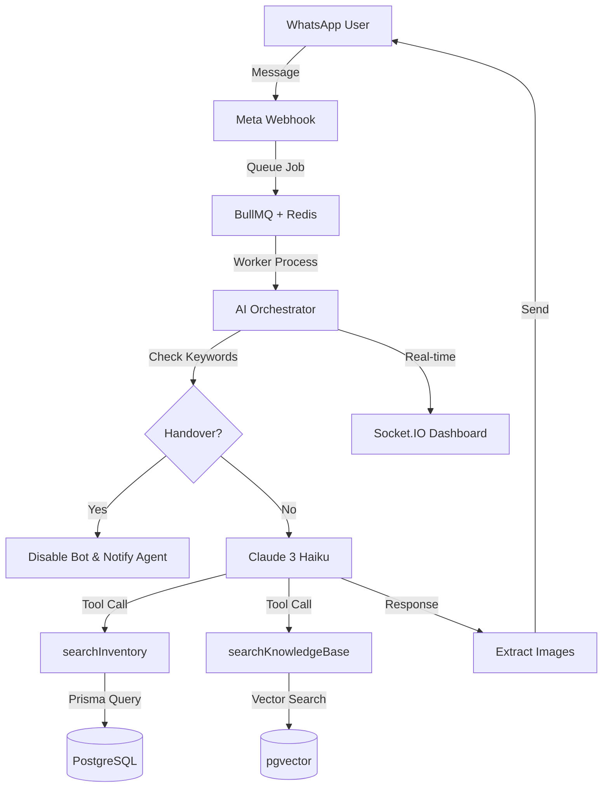

# AI System Overview

KAIU Natural Living uses an AI-powered WhatsApp assistant to provide 24/7 customer support in Spanish. The system handles product inquiries, inventory searches, and knowledge base queries with automatic handover to human agents when needed.

## Key Features

- **Claude 3 Haiku Integration**: Fast and cost-effective conversational AI
- **RAG System**: Retrieval Augmented Generation with pgvector for accurate product and policy information
- **Function Calling**: Native Anthropic tool use for inventory and knowledge base searches
- **PII Protection**: Automatic redaction of emails and phone numbers from conversation history
- **Smart Handover**: Keyword-based escalation to human agents
- **Image Support**: Automatic product image sending with `[SEND_IMAGE]` tags
- **Real-time Dashboard**: Socket.IO integration for live chat monitoring

## System Architecture

## Technology Stack

| Component | Technology |
|-----------|------------|
| LLM | Anthropic Claude 3 Haiku (`claude-3-haiku-20240307`) |
| Framework | LangChain.js |
| Database | PostgreSQL with pgvector extension |
| Queue | BullMQ + Redis |
| Messaging | Meta WhatsApp Business API |
| Real-time | Socket.IO |

## Core Components

<CardGroup cols={2}>
  <Card title="RAG System" icon="database" href="/ai/rag-system">
    Vector search with pgvector for knowledge retrieval
  </Card>
  <Card title="Function Tools" icon="wrench" href="/ai/tools-functions">
    searchInventory and searchKnowledgeBase implementations
  </Card>
  <Card title="Handover Protocol" icon="hand" href="/ai/handover-protocol">
    Automatic escalation to human agents
  </Card>
  <Card title="PII Privacy" icon="shield" href="/ai/pii-privacy">
    Privacy protection and data redaction
  </Card>
</CardGroup>

## Quick Start

1. Configure environment variables (see [Setup](/ai/setup))
2. Enable pgvector extension in PostgreSQL
3. Populate knowledge base (see [Knowledge Base Management](/ai/knowledge-base-management))
4. Deploy worker process with BullMQ

<Info>
  The AI system is currently configured for **memory optimization** on free-tier cloud hosting. Vector embeddings are bypassed with zeros to prevent OOM errors.
</Info>

## Next Steps

<Card title="Architecture Deep Dive" icon="chart-network" href="/ai/architecture">
  Explore the complete system architecture and data flow
</Card>