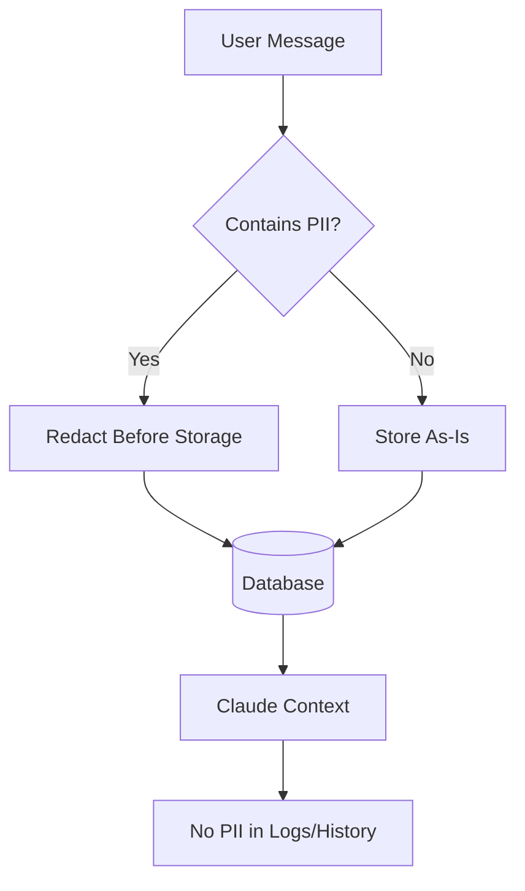

# PII & Privacy Protection

KAIU's AI system automatically redacts Personally Identifiable Information (PII) from conversation histories before storing them in the database. This ensures customer privacy and compliance with data protection regulations.

## Why Redact PII?



<Info>
  **Privacy First**: PII is redacted from the **conversation history** stored in `sessionContext`, but the original message is still sent to Claude for immediate processing. This balances privacy with functionality.
</Info>

## PII Filter Implementation

### Redaction Function (`pii-filter.js:1-23`)

```javascript
export const redactPII = (text) => {
    if (!text) return text;

    let redacted = text;

    // 1. Emails
    const emailRegex = /\b[A-Za-z0-9._%+-]+@[A-Za-z0-9.-]+\.[A-Z|a-z]{2,}\b/g;
    redacted = redacted.replace(emailRegex, "[REDACTED EMAIL]");

    // 2. Phone Numbers (Colombian mobile format)
    // Matches: 3xx xxx xxxx, +57 3xx..., 3xxxxxxxxx
    const phoneRegex = /(?:\+57|57)?\s?3[0-9]{2}[\s\-]?[0-9]{3}[\s\-]?[0-9]{4}/g;
    redacted = redacted.replace(phoneRegex, "[REDACTED PHONE]");

    // 3. Credit Cards (commented out to avoid false positives)
    // const ccRegex = /\b(?:\d[ -]*?){13,16}\b/g;
    // redacted = redacted.replace(ccRegex, "[REDACTED CARD]");
    // Avoided to prevent matching product codes or tracking numbers

    return redacted;
};
```

## Supported PII Types

<CardGroup cols={2}>
  <Card title="Email Addresses" icon="envelope">
    Matches standard email formats (RFC 5322 simplified)
    
    **Pattern**: `[A-Za-z0-9._%+-]+@[A-Za-z0-9.-]+\.[A-Z|a-z]{2,}`
  </Card>
  
  <Card title="Phone Numbers" icon="phone">
    Matches Colombian mobile numbers with various formats
    
    **Pattern**: `(?:\+57|57)?\s?3[0-9]{2}[\s\-]?[0-9]{3}[\s\-]?[0-9]{4}`
  </Card>
</CardGroup>

## Redaction Examples

<CodeGroup>
```txt Email Redaction
Input:  "Mi correo es juan.perez@gmail.com"
Output: "Mi correo es [REDACTED EMAIL]"
```

```txt Phone Redaction (Format 1)
Input:  "Llámame al 321 456 7890"
Output: "Llámame al [REDACTED PHONE]"
```

```txt Phone Redaction (Format 2)
Input:  "Mi número es +57 310-123-4567"
Output: "Mi número es [REDACTED PHONE]"
```

```txt Phone Redaction (Format 3)
Input:  "Escríbeme a 3001234567"
Output: "Escríbeme a [REDACTED PHONE]"
```

```txt Multiple PII
Input:  "Soy María, mi email es maria@hotmail.com y mi cel es 315 789 0123"
Output: "Soy María, mi email es [REDACTED EMAIL] y mi cel es [REDACTED PHONE]"
```

```txt No PII
Input:  "¿Tienen aceite de lavanda en 10ml?"
Output: "¿Tienen aceite de lavanda en 10ml?"
```
</CodeGroup>

## Integration in Queue Worker

### Before Storage (`queue.js:67-71`)

```javascript
// 3. Append User Message
// Redact PII before storing in history (Context Window Privacy)
const cleanText = redactPII(text);

const userMsg = { role: 'user', content: cleanText };
history.push(userMsg);
```

### Original vs. Redacted

| Stage | Content Used |
|-------|-------------|
| **Immediate Claude API Call** | Original `text` (for accurate processing) |
| **Database Storage** | Redacted `cleanText` (for privacy) |
| **Dashboard Display** | Original `text` (real-time, not from history) |
| **Future Context** | Redacted `cleanText` (from session history) |

<Warning>
  The **current message** is sent to Claude with the original text for accurate processing. Only the **stored history** is redacted.
</Warning>

## Why Credit Cards Are Disabled

The credit card regex is commented out to avoid false positives:

```javascript
// 3. Credit Cards (Luhn algorithm checks are complex, simple regex for 13-16 digits)
const ccRegex = /\b(?:\d[ -]*?){13,16}\b/g;
// Commented out to avoid false positives on product codes or tracking numbers without more context.
// Let's stick to emails and phones for now which are high risk.
```

**Reasons**:
- Product SKUs often have long numeric sequences
- Tracking numbers could be falsely matched
- No Luhn algorithm validation (would match random 16-digit strings)

<Tip>
  For production, integrate a Luhn validator before redacting card numbers:
  
  ```javascript
  import { luhn } from 'luhn-js';
  
  if (luhn.validate(match)) {
      redacted = redacted.replace(match, "[REDACTED CARD]");
  }
  ```
</Tip>

## Extending PII Protection

### Adding Colombian ID Numbers (Cédula)

```javascript
export const redactPII = (text) => {
    if (!text) return text;
    let redacted = text;

    // Existing email and phone redaction...

    // 3. Colombian ID (Cédula)
    // Matches 6-10 digit sequences (common range)
    const cedulaRegex = /\b[0-9]{6,10}\b/g;
    redacted = redacted.replace(cedulaRegex, "[REDACTED ID]");

    return redacted;
};
```

<Warning>
  Be careful with numeric redaction - it may affect order numbers, product codes, or quantities.
</Warning>

### Adding Address Redaction

```javascript
// 4. Street Addresses (Spanish)
const addressRegex = /\b(calle|carrera|avenida|transversal|diagonal)\s+[0-9]+[a-z]?\s*(#|no\.?)\s*[0-9]+[a-z]?\s*-\s*[0-9]+/gi;
redacted = redacted.replace(addressRegex, "[REDACTED ADDRESS]");
```

### Adding Name Redaction (Advanced)

For name detection, use a Named Entity Recognition (NER) library:

```javascript
import { nlp } from 'compromise';

export const redactPII = (text) => {
    if (!text) return text;
    let redacted = text;

    // Email and phone redaction...

    // 4. Names (NER)
    const doc = nlp(text);
    const names = doc.people().out('array');
    
    names.forEach(name => {
        redacted = redacted.replace(new RegExp(`\\b${name}\\b`, 'gi'), "[REDACTED NAME]");
    });

    return redacted;
};
```

## Testing PII Redaction

```javascript
import { redactPII } from '../utils/pii-filter.js';

const testCases = [
    {
        input: "Mi email es test@example.com",
        expected: "Mi email es [REDACTED EMAIL]"
    },
    {
        input: "Llámame al 321 456 7890",
        expected: "Llámame al [REDACTED PHONE]"
    },
    {
        input: "Contacto: +57 310-123-4567 o admin@kaiu.co",
        expected: "Contacto: [REDACTED PHONE] o [REDACTED EMAIL]"
    },
    {
        input: "¿Tienen lavanda?",
        expected: "¿Tienen lavanda?"
    }
];

testCases.forEach(({ input, expected }) => {
    const result = redactPII(input);
    console.assert(result === expected, `Failed: ${input}`);
    console.log(`✅ ${input} → ${result}`);
});
```

## Database Privacy

### Session Context Structure

```json
{
  "history": [
    {
      "role": "user",
      "content": "Hola, quiero información sobre lavanda"
    },
    {
      "role": "assistant",
      "content": "¡Claro! Tenemos Aceite Esencial Lavanda en 10ml..."
    },
    {
      "role": "user",
      "content": "Perfecto, mi correo es [REDACTED EMAIL]" // PII redacted
    }
  ]
}
```

### Querying Redacted History

```javascript
const session = await prisma.whatsAppSession.findUnique({
    where: { phoneNumber: '+57 321 456 7890' },
    select: {
        id: true,
        sessionContext: true // Contains redacted history
    }
});

const history = session.sessionContext?.history || [];
// PII already redacted in stored messages
```

## Compliance Considerations

<CardGroup cols={2}>
  <Card title="GDPR" icon="scale-balanced">
    Redaction helps with **data minimization** principle by not storing unnecessary PII
  </Card>
  <Card title="CCPA" icon="shield">
    Reduces risk of PII exposure in database backups and logs
  </Card>
  <Card title="Local Regulations" icon="flag">
    Complies with Colombian data protection laws (Ley 1581 de 2012)
  </Card>
  <Card title="Right to Erasure" icon="eraser">
    Simplifies GDPR "Right to be Forgotten" requests
  </Card>
</CardGroup>

## Logging Privacy

Ensure PII is also redacted from logs:

```javascript
// Good: Redact before logging
console.log(`Processing message: "${redactPII(text)}"`);

// Bad: Logs raw PII
console.log(`Processing message: "${text}"`);
```

## Real-time Dashboard

The Socket.IO dashboard receives **original** messages in real-time:

```javascript
// queue.js:74-80
if (io) {
    io.to(`session_${session.id}`).emit('new_message', { 
        sessionId: session.id, 
        message: { role: 'user', content: text, time: "Just now" } // Original text
    });
}
```

<Info>
  Real-time messages are **not stored** - they're only for live monitoring. Agents see the original message, but it's not persisted.
</Info>

## Best Practices

<CardGroup cols={2}>
  <Card title="Redact Early" icon="clock">
    Apply redaction immediately before storage, not at query time
  </Card>
  <Card title="Test Thoroughly" icon="flask">
    Create comprehensive test cases for all PII patterns
  </Card>
  <Card title="Avoid Over-Redaction" icon="triangle-exclamation">
    Balance privacy with functionality (don't redact product codes)
  </Card>
  <Card title="Audit Regularly" icon="magnifying-glass">
    Periodically review stored histories for PII leaks
  </Card>
</CardGroup>

## Next Steps

<CardGroup cols={2}>
  <Card title="Architecture" icon="sitemap" href="/ai/architecture">
    Understand how PII redaction fits into the overall system
  </Card>
  <Card title="Setup" icon="gear" href="/ai/setup">
    Configure environment variables and database
  </Card>
</CardGroup>