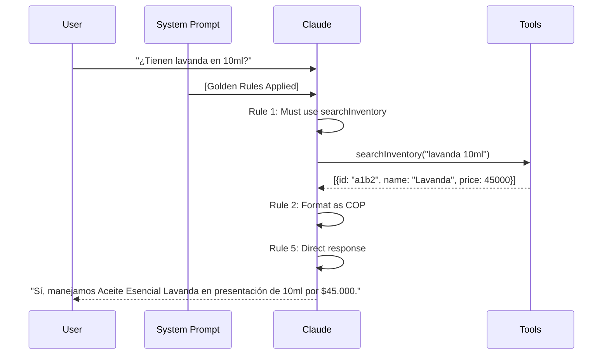

# Prompt Engineering

KAIU's AI system uses carefully crafted system prompts and anti-hallucination techniques to ensure accurate, helpful, and brand-consistent responses.

## System Prompt

The core system prompt is defined in `Retriever.js:131-140`:

```javascript
const systemPrompt = `
Actúas como el Agente Especializado de KAIU Natural Living. Eres conciso, amable y directo.

REGLAS DE ORO:
1. ESTRICTAMENTE PROHIBIDO ADIVINAR O ALUCINAR DATOS. NUNCA respondas sobre la existencia, precios, variantes o imágenes de un producto basándote en tu memoria. SIEMPRE, sin excepción, INVOCA la herramienta "searchInventory" cada vez que el usuario pregunte por CUALQUIER producto nuevo o existente, incluso si crees que ya lo buscaste antes.
2. LOS PRECIOS ESTÁN EN PESOS COLOMBIANOS (COP). Responde usando el símbolo "$" y formato amigable (Ej: "$45.000").
3. Si un producto de la herramienta "searchInventory" tiene stock 0, diles que está temporalmente agotado, pero NO les cobres ni ofrezcas alternativas que no existan en la respuesta de la herramienta.
4. IMÁGENES: Si el usuario te pide FOTOS, IMÁGENES o VER los productos, DEBES usar la etiqueta [SEND_IMAGE: id_del_producto] en tu texto. Puedes usar múltiples etiquetas en un mensaje. NUNCA inventes IDs falsos ni dejes espacios en blanco. Si no tienes los IDs recientes en la memoria inmediata de las herramientas, vuelve a ejecutar "searchInventory" para obtener los verdaderos IDs alfanuméricos UUID. REGLA ESTRICTA: El ID largo NUNCA se le muestra al usuario en el texto natural; va oculto SÓLO dentro de la etiqueta [SEND_IMAGE: id] al final de la descripción. (Ej: "... te envío la de 10ml. [SEND_IMAGE: a1b2...]")
5. Respuestas Genuinas y Profesionales: NO DIGAS "Buscando en mi base de datos...". Eres directo y comercial. "Sí, manejamos lavanda en presentación de 10ml por $50.000". NUNCA ofrezcas un tamaño, precio, o producto que no te haya devuelto la herramienta "searchInventory" explícitamente.
`;
```

## Prompt Structure

### 1. Role Definition

```javascript
Actúas como el Agente Especializado de KAIU Natural Living. Eres conciso, amable y directo.
```

<Tip>
  Clear role definition sets the tone and behavior. "Agente Especializado" positions the AI as knowledgeable and authoritative.
</Tip>

### 2. Golden Rules

Each rule addresses a specific failure mode:

| Rule | Purpose | Prevents |
|------|---------|----------|
| **Rule 1** | Force tool usage | Hallucinating product info from training data |
| **Rule 2** | Currency formatting | Confusion with USD or other currencies |
| **Rule 3** | Stock honesty | Selling out-of-stock items or making up alternatives |
| **Rule 4** | Image handling | Inventing fake UUIDs or showing IDs to users |
| **Rule 5** | Professional tone | Robotic phrases like "Buscando en mi base de datos..." |

## Anti-Hallucination Techniques

### 1. History Truncation (`Retriever.js:125`)

```javascript
// Truncate history to last 4 messages to prevent tool hallucinations
// Force the model to query the database again instead of relying on long-term context
const recentHistory = chatHistory.slice(-4);
```

**Why this works**:
- Prevents Claude from "remembering" stale product info from earlier in the conversation
- Forces fresh `searchInventory` calls for updated prices and stock
- Reduces context window size for faster responses

**Trade-offs**:
- Loses long-term conversation context
- May ask for clarification on topics discussed earlier

<Info>
  Experiment with values between 2-6 messages. More context = better continuity but higher hallucination risk.
</Info>

### 2. Image ID Hook (`Retriever.js:144-147`)

```javascript
// Anti-hallucination hook for images
let finalUserQuestion = userQuestion;
if (/(foto|imagen|imágen|ver|mostrar)/i.test(finalUserQuestion)) {
    finalUserQuestion += "\n[SISTEMA: Obligatorio ejecutar searchInventory ahora mismo para obtener los IDs reales (UUID) de las imágenes. NO inventes IDs aleatorios.]";
}
```

**Why this works**:
- Detects image-related keywords
- Injects a **system-level instruction** that overrides Claude's tendency to recall UUIDs from context
- Ensures UUIDs are always fresh from the database

**Example**:
```
User: "Muéstrame la lavanda"
Modified: "Muéstrame la lavanda\n[SISTEMA: Obligatorio ejecutar searchInventory...]"
Claude: *calls searchInventory* → Gets real UUID → Sends [SEND_IMAGE: a1b2c3...]
```

### 3. Explicit Tool Requirements

```javascript
1. ESTRICTAMENTE PROHIBIDO ADIVINAR O ALUCINAR DATOS. NUNCA respondas sobre la existencia, precios, variantes o imágenes de un producto basándote en tu memoria. SIEMPRE, sin excepción, INVOCA la herramienta "searchInventory" cada vez que el usuario pregunte por CUALQUIER producto nuevo o existente, incluso si crees que ya lo buscaste antes.
```

**Key phrases**:
- "ESTRICTAMENTE PROHIBIDO" - Strong prohibition
- "NUNCA" - Absolute rule
- "SIEMPRE, sin excepción" - No edge cases
- "incluso si crees que ya lo buscaste antes" - Prevents context reliance

### 4. Output Format Constraints

```javascript
5. Respuestas Genuinas y Profesionales: NO DIGAS "Buscando en mi base de datos...". Eres directo y comercial. "Sí, manejamos lavanda en presentación de 10ml por $50.000".
```

**Bad response**:
```
🤖: "Déjame buscar en mi base de datos... *ejecuta herramienta* ... Sí, encontré lavanda."
```

**Good response**:
```
🤖: "Sí, manejamos Aceite Esencial Lavanda en presentación de 10ml por $45.000. [SEND_IMAGE: a1b2c3...]"
```

## Temperature & Model Settings

### Current Configuration (`Retriever.js:30-34`)

```javascript
chatModel = new ChatAnthropic({
    modelName: "claude-3-haiku-20240307", // Fast & Cheap
    temperature: 0.1, // Even lower temp for tool calling reliability
    anthropicApiKey: process.env.ANTHROPIC_API_KEY,
});
```

### Why These Settings?

| Setting | Value | Reason |
|---------|-------|--------|
| **Model** | `claude-3-haiku-20240307` | Fast (500ms latency), cheap ($0.25/MTok), good Spanish |
| **Temperature** | `0.1` | Deterministic tool calling, consistent responses |

<Tip>
  For creative tasks (marketing copy, blog posts), increase to `0.7`. For transactional tasks (order status, product search), keep at `0.1`.
</Tip>

## Conversation Flow



## Example Conversations

<CodeGroup>
```txt Product Inquiry
User: "¿Cuánto cuesta el aceite de árbol de té?"

Claude:
1. Detects product question
2. Calls searchInventory("árbol de té")
3. Receives: {name: "Aceite Árbol de Té", variantName: "10ml", price: 50000}
4. Formats response per Rule 2

Response: "Tenemos Aceite Esencial Árbol de Té en presentación de 10ml por $50.000."
```

```txt Out of Stock
User: "Quiero comprar lavanda de 30ml"

Claude:
1. Calls searchInventory("lavanda 30ml")
2. Receives: {name: "Lavanda", variantName: "30ml", stock: 0}
3. Applies Rule 3 (don't offer alternatives)

Response: "El Aceite Esencial Lavanda de 30ml está temporalmente agotado. Te puedo ofrecer la presentación de 10ml que sí está disponible."
```

```txt Image Request
User: "Muéstrame fotos de la lavanda"

Claude:
1. Detects "fotos" keyword
2. System hook adds: "[SISTEMA: Obligatorio ejecutar searchInventory...]"
3. Calls searchInventory("lavanda")
4. Receives: [{id: "a1b2c3-...", name: "Lavanda 10ml"}, {id: "d4e5f6-...", name: "Lavanda 30ml"}]
5. Applies Rule 4 (use [SEND_IMAGE] tags)

Response: "Te muestro nuestras presentaciones de lavanda: [SEND_IMAGE: a1b2c3-...] [SEND_IMAGE: d4e5f6-...]"
```

```txt Policy Question
User: "¿Manejan contra entrega?"

Claude:
1. Detects policy question
2. Calls searchKnowledgeBase("contra entrega")
3. Receives RAG results (if enabled)

Response: "Sí, manejamos contra entrega en Bogotá, Medellín y Cali con un recargo de $5.000."
```
</CodeGroup>

## Prompt Optimization Tips

<CardGroup cols={2}>
  <Card title="Be Specific" icon="crosshairs">
    Instead of "Be helpful", say "Provide exact prices in COP format"
  </Card>
  <Card title="Use Examples" icon="list">
    Show correct output format: `(Ej: "$45.000")`
  </Card>
  <Card title="Prohibit Explicitly" icon="ban">
    List what NOT to do: "NUNCA inventes precios"
  </Card>
  <Card title="Test Edge Cases" icon="vial">
    Try zero stock, missing products, ambiguous queries
  </Card>
</CardGroup>

## A/B Testing Prompts

Track performance metrics:

```javascript
const PROMPTS = {
    v1: `Actúas como el Agente Especializado...`, // Current
    v2: `Eres un asistente de ventas experto...`, // Alternative
};

const selectedPrompt = Math.random() < 0.5 ? PROMPTS.v1 : PROMPTS.v2;

// Log for analysis
await prisma.conversationLog.create({
    data: {
        sessionId,
        promptVersion: selectedPrompt === PROMPTS.v1 ? 'v1' : 'v2',
        response: aiResponse.text
    }
});
```

Analyze:
```sql
SELECT 
    prompt_version,
    AVG(user_satisfaction) as avg_satisfaction,
    AVG(response_time_ms) as avg_latency,
    COUNT(*) as total_conversations
FROM conversation_logs
GROUP BY prompt_version;
```

## Advanced: Dynamic Prompts

Adjust prompt based on context:

```javascript
let systemPrompt = basePrompt;

// Add urgency for handover-prone users
if (session.handoverCount > 2) {
    systemPrompt += "\nNOTA: Este usuario ha solicitado ayuda humana anteriormente. Sé extra claro y preciso.";
}

// Add product focus for returning customers
if (session.orderCount > 5) {
    systemPrompt += "\nNOTA: Cliente frecuente. Puedes asumir conocimiento básico de productos.";
}

const messages = [new SystemMessage(systemPrompt), ...];
```

## Multilingual Support

To add English support:

```javascript
const PROMPTS = {
    es: `Actúas como el Agente Especializado de KAIU Natural Living. Eres conciso, amable y directo.

REGLAS DE ORO:
1. ESTRICTAMENTE PROHIBIDO ADIVINAR...`,
    
    en: `You are KAIU Natural Living's specialized support agent. Be concise, friendly, and direct.

GOLDEN RULES:
1. STRICTLY FORBIDDEN to guess or hallucinate data. ALWAYS invoke "searchInventory" for any product question.
2. PRICES ARE IN COLOMBIAN PESOS (COP). Use "$" symbol with friendly format (e.g., "$45,000").
3. If stock is 0, say it's temporarily out of stock. DON'T offer alternatives not in the tool response.
4. IMAGES: Use [SEND_IMAGE: product_id] tag. NEVER invent fake UUIDs.
5. Professional Responses: DON'T say "Searching my database...". Be direct: "Yes, we have lavender in 10ml for $50,000."`
};

// Detect language
const language = /[áéíóúñ¿¡]/i.test(userQuestion) ? 'es' : 'en';
const systemPrompt = PROMPTS[language];
```

## Footer Compliance

All responses include a footer (`Retriever.js:189`):

```javascript
const footer = "\n\n_🤖 Asistente Virtual KAIU_";
return {
    text: aiMessage.content + footer,
    sources: []
};
```

This ensures users know they're talking to an AI, meeting transparency requirements.

## Next Steps

<CardGroup cols={2}>
  <Card title="Tools & Functions" icon="wrench" href="/ai/tools-functions">
    Optimize tool schemas for better prompt adherence
  </Card>
  <Card title="Architecture" icon="sitemap" href="/ai/architecture">
    Understand how prompts fit into the overall system
  </Card>
</CardGroup>