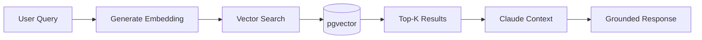

# RAG System

KAIU uses a RAG (Retrieval Augmented Generation) architecture to ground AI responses in factual product data and company policies. The system leverages PostgreSQL's pgvector extension for semantic search.

## Overview



## Vector Database Schema

### Prisma Model (`schema.prisma:184-196`)

```prisma
model KnowledgeBase {
  id        String   @id @default(uuid())
  content   String   @db.Text
  metadata  Json?    // { source: "product", id: "...", title: "..." }
  
  // Postgres pgvector support via Prisma Unsupported type
  // Requires: CREATE EXTENSION IF NOT EXISTS vector;
  embedding Unsupported("vector(1536)")?
  
  createdAt DateTime @default(now())
  
  @@map("knowledge_base")
}
```

### SQL Setup

```sql
-- Enable pgvector extension
CREATE EXTENSION IF NOT EXISTS vector;

-- Create index for fast cosine similarity search
CREATE INDEX ON knowledge_base 
USING ivfflat (embedding vector_cosine_ops) 
WITH (lists = 100);
```

## Embedding Pipeline

### Current Implementation (Memory-Optimized)

```javascript
// Retriever.js:13-20
let embeddingPipe = null;

async function getEmbeddingPipe() {
    if (!embeddingPipe) {
        console.log("🔌 Loading Embedding Model (BYPASSED FOR RENDER FREE TIER OOM PROTECTION)...");
        // Bypass actual transformer load to save 300MB of RAM
        embeddingPipe = () => { return { toList: () => new Array(1536).fill(0.0) } };
    }
    return embeddingPipe;
}
```

<Warning>
  **Production Warning**: The current implementation returns zero vectors to save memory on free hosting. This disables semantic search functionality.
</Warning>

### Production Implementation

For production use, replace with a real embedding model:

<CodeGroup>
```javascript Xenova Transformers
import { pipeline } from '@xenova/transformers';

let embeddingPipe = null;

async function getEmbeddingPipe() {
    if (!embeddingPipe) {
        embeddingPipe = await pipeline(
            'feature-extraction',
            'Xenova/all-MiniLM-L6-v2'
        );
    }
    return embeddingPipe;
}

async function generateEmbedding(text) {
    const pipe = await getEmbeddingPipe();
    const output = await pipe(text, { pooling: 'mean', normalize: true });
    return Array.from(output.data);
}
```

```javascript OpenAI
import OpenAI from 'openai';

const openai = new OpenAI({ apiKey: process.env.OPENAI_API_KEY });

async function generateEmbedding(text) {
    const response = await openai.embeddings.create({
        model: 'text-embedding-3-small',
        input: text,
    });
    return response.data[0].embedding;
}
```

```javascript Cohere
import { CohereClient } from 'cohere-ai';

const cohere = new CohereClient({ token: process.env.COHERE_API_KEY });

async function generateEmbedding(text) {
    const response = await cohere.embed({
        texts: [text],
        model: 'embed-multilingual-v3.0',
        inputType: 'search_query',
    });
    return response.embeddings[0];
}
```
</CodeGroup>

## Vector Search Implementation

### Current Tool (`Retriever.js:107-113`)

```javascript
async function executeSearchKnowledgeBase(query) {
    console.log(`🧠 (OOM Protection) Executing Tool: searchKnowledgeBase for query: "${query}"`);
    return JSON.stringify({ 
        info: "Políticas y RAG desactivado temporalmente por limites de Memoria RAM en servidor Cloud gratuito original. Dile al cliente que te repita la pregunta directa o solicite agendamiento humano si la duda es sobre politicas de envios. No trates de inventar politicas.",
        original_query: query 
    });
}
```

### Production Implementation

```javascript
async function executeSearchKnowledgeBase(query) {
    console.log(`🧠 Executing Tool: searchKnowledgeBase for query: "${query}"`);
    
    // Generate query embedding
    const queryEmbedding = await generateEmbedding(query);
    const embeddingString = `[${queryEmbedding.join(',')}]`;
    
    // Vector similarity search with pgvector
    const results = await prisma.$queryRaw`
        SELECT 
            id,
            content,
            metadata,
            1 - (embedding <=> ${embeddingString}::vector) AS similarity
        FROM knowledge_base
        WHERE embedding IS NOT NULL
        ORDER BY embedding <=> ${embeddingString}::vector
        LIMIT 5
    `;
    
    // Filter by similarity threshold
    const relevantResults = results.filter(r => r.similarity > 0.7);
    
    if (relevantResults.length === 0) {
        return JSON.stringify({ 
            error: "No se encontró información relevante en la base de conocimientos."
        });
    }
    
    return JSON.stringify(relevantResults.map(r => ({
        content: r.content,
        metadata: r.metadata,
        similarity: r.similarity
    })));
}
```

## Knowledge Base Management

### Adding Documents (`knowledge.js:26-40`)

```javascript
if (req.method === 'POST') {
    const { content, title, type } = req.body;
    if (!content) return res.status(400).json({ error: 'Content is required' });
    
    // Generate embedding (in production)
    const embedding = await generateEmbedding(content);
    
    const newKnowledge = await prisma.knowledgeBase.create({
        data: {
            content,
            metadata: { title: title || 'Sin Título', type: type || 'Documento' },
            embedding: embedding // Store as vector
        }
    });
    return res.status(201).json({ success: true, id: newKnowledge.id });
}
```

### Fetching Knowledge (`knowledge.js:16-23`)

```javascript
if (req.method === 'GET') {
    // Fetch knowledge without massive vector embeddings to save bandwidth
    const items = await prisma.$queryRaw`
        SELECT id, content, metadata, "createdAt" 
        FROM knowledge_base 
        ORDER BY "createdAt" DESC
    `;
    return res.status(200).json(items);
}
```

<Note>
  Embeddings are excluded from GET requests to reduce bandwidth. They're only used for search queries.
</Note>

## Tool Schema (`Retriever.js:58-72`)

```javascript
{
    name: "searchKnowledgeBase",
    description: "Busca en el 'Cerebro RAG' manuales de la empresa, tiempos de envío, costos de envío a ciudades, y políticas generales de la marca.",
    input_schema: {
        type: "object",
        properties: {
            query: {
                type: "string",
                description: "La pregunta o concepto a buscar en la base de políticas (Ej: 'Tiempos de envío Bogotá', 'Manejan contra entrega').",
            }
        },
        required: ["query"],
    },
}
```

## Document Types

The knowledge base stores various document types:

| Type | Example Content |
|------|----------------|
| `Política` | Shipping policies, return policies |
| `Documento` | Company manuals, procedures |
| `FAQ` | Common questions and answers |
| `Ciudad` | City-specific shipping costs/times |
| `Producto` | Product guides, usage instructions |

## Similarity Search Operators

pgvector provides three distance operators:

| Operator | Description | Use Case |
|----------|-------------|----------|
| `<->` | Euclidean (L2) | General purpose |
| `<=>` | Cosine distance | Text embeddings (recommended) |
| `<#>` | Inner product | Pre-normalized vectors |

<Tip>
  Use **cosine distance** (`<=>`) for text embeddings as it's normalized and handles varying document lengths well.
</Tip>

## Index Types

### IVFFlat Index (Recommended)

```sql
CREATE INDEX ON knowledge_base 
USING ivfflat (embedding vector_cosine_ops) 
WITH (lists = 100);
```

- **Fast queries** with approximate results
- **lists**: Number of clusters (rule of thumb: `rows / 1000`)
- Best for 10K+ documents

### HNSW Index (Advanced)

```sql
CREACreate INDEX ON knowledge_base 
USING hnsw (embedding vector_cosine_ops) 
WITH (m = 16, ef_construction = 64);
```

- **Hierarchical Navigable Small World** graphs
- Better recall than IVFFlat but slower build time
- Best for 100K+ documents

## Context Injection

Retrieved documents are injected into Claude's context:

```javascript
const systemPrompt = `
Actúas como el Agente Especializado de KAIU Natural Living.

REGLAS DE ORO:
1. ESTRICTAMENTE PROHIBIDO ADIVINAR O ALUCINAR DATOS.
2. Usa searchKnowledgeBase para políticas, tiempos de envío, y costos.
3. NUNCA inventes políticas que no estén en los resultados de las herramientas.
`;
```

When the tool returns results:

```javascript
messages.push(new ToolMessage({
    tool_call_id: toolCall.id,
    content: JSON.stringify(relevantResults), // Injected context
    name: 'searchKnowledgeBase'
}));
```

## Performance Considerations

<CardGroup cols={2}>
  <Card title="Embedding Latency" icon="clock">
    - Xenova/Transformers: ~50-100ms (local)
    - OpenAI API: ~200-300ms (network)
    - Cohere API: ~150-250ms (network)
  </Card>
  <Card title="Vector Search" icon="magnifying-glass">
    - IVFFlat: ~10-50ms for 10K docs
    - HNSW: ~5-20ms for 100K docs
    - Exact search: ~100ms+ for 10K docs
  </Card>
</CardGroup>

## Next Steps

<CardGroup cols={2}>
  <Card title="Knowledge Base Management" icon="books" href="/ai/knowledge-base-management">
    Learn how to populate and maintain the knowledge base
  </Card>
  <Card title="Tools & Functions" icon="wrench" href="/ai/tools-functions">
    Explore all available AI tools
  </Card>
</CardGroup>