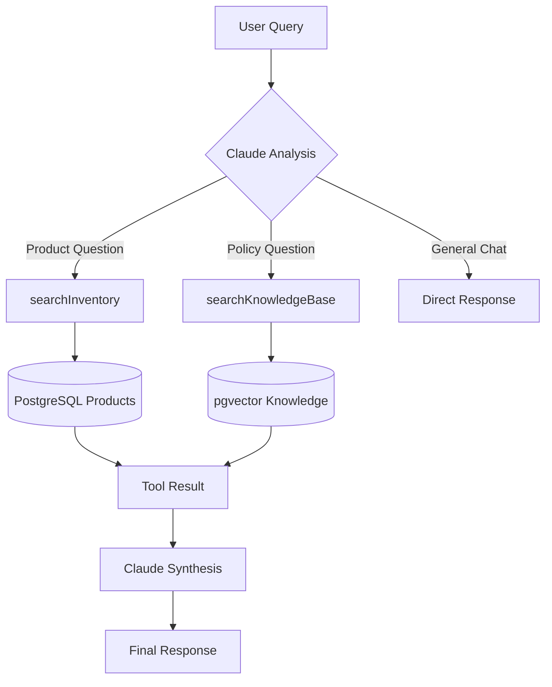
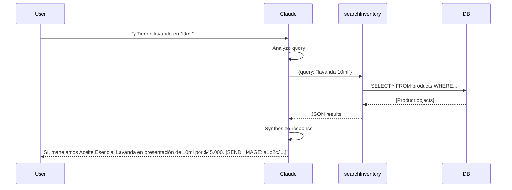

# AI Tools & Functions

KAIU's AI uses Anthropic's native tool calling (function calling) to interact with the product inventory and knowledge base. The system defines two primary tools that Claude can invoke during conversations.

## Tool Architecture



## Tool Definitions

### 1. searchInventory

Searches the product catalog for prices, availability, and variants.

#### Schema (`Retriever.js:44-57`)

```javascript
{
    name: "searchInventory",
    description: "Busca en el inventario actual (catálogo de productos) de KAIU para responder preguntas sobre precios, disponibilidad, y variantes. ÚSALA SIEMPRE que el cliente pregunte por un producto específico, precios o si 'tienen' algo.",
    input_schema: {
        type: "object",
        properties: {
            query: {
                type: "string",
                description: "El nombre del producto, ingrediente o variante a buscar (Ej: 'Lavanda', 'Gotero 10ml', 'Árbol de Té'). Omitir saludos. Omitir conectores.",
            }
        },
        required: ["query"],
    },
}
```

#### Implementation (`Retriever.js:74-105`)

```javascript
async function executeSearchInventory(query) {
    console.log(`🛠️ Executing Tool: searchInventory with query: "${query}"`);
    
    // Split query into search terms (words longer than 3 chars)
    const terms = query.split(' ').filter(w => w.length > 3);
    const searchConditions = terms.map(t => ({
        OR: [
            { name: { contains: t, mode: 'insensitive' } },
            { category: { contains: t, mode: 'insensitive' } },
            { variantName: { contains: t, mode: 'insensitive' } }
        ]
    }));

    // Fallback to direct match if no terms meet length requirement
    const filter = searchConditions.length > 0 
        ? { OR: searchConditions } 
        : { name: { contains: query, mode: 'insensitive' } };

    const products = await prisma.product.findMany({
        where: filter,
        select: { 
            id: true, 
            name: true, 
            variantName: true, 
            price: true, 
            stock: true, 
            isActive: true, 
            category: true, 
            description: true 
        }
    });
    
    // Filter out inactive products
    const activeProducts = products.filter(p => p.isActive);

    if (activeProducts.length === 0) {
        return JSON.stringify({ 
            error: "No se encontraron productos coincidentes en el inventario." 
        });
    }
    
    return JSON.stringify(activeProducts);
}
```

#### Example Usage

<CodeGroup>
```json Query: "lavanda"
// Claude calls:
{
  "name": "searchInventory",
  "args": { "query": "lavanda" }
}

// Returns:
[
  {
    "id": "a1b2c3d4-5678-90ab-cdef-1234567890ab",
    "name": "Aceite Esencial Lavanda",
    "variantName": "Gotero 10ml",
    "price": 45000,
    "stock": 15,
    "isActive": true,
    "category": "Aceites Esenciales",
    "description": "Aceite puro de lavanda para relajación"
  },
  {
    "id": "b2c3d4e5-6789-01bc-def2-234567890abc",
    "name": "Aceite Esencial Lavanda",
    "variantName": "Gotero 30ml",
    "price": 120000,
    "stock": 8,
    "isActive": true,
    "category": "Aceites Esenciales",
    "description": "Aceite puro de lavanda para relajación"
  }
]
```

```json Query: "árbol de té 10ml"
// Claude calls:
{
  "name": "searchInventory",
  "args": { "query": "árbol té 10ml" }
}

// Returns:
[
  {
    "id": "c3d4e5f6-7890-12cd-ef34-34567890bcde",
    "name": "Aceite Esencial Árbol de Té",
    "variantName": "Gotero 10ml",
    "price": 50000,
    "stock": 0,
    "isActive": true,
    "category": "Aceites Esenciales",
    "description": "Aceite antibacterial natural"
  }
]
```
</CodeGroup>

### 2. searchKnowledgeBase

Searches company policies, shipping info, and brand guidelines.

#### Schema (`Retriever.js:58-72`)

```javascript
{
    name: "searchKnowledgeBase",
    description: "Busca en el 'Cerebro RAG' manuales de la empresa, tiempos de envío, costos de envío a ciudades, y políticas generales de la marca.",
    input_schema: {
        type: "object",
        properties: {
            query: {
                type: "string",
                description: "La pregunta o concepto a buscar en la base de políticas (Ej: 'Tiempos de envío Bogotá', 'Manejan contra entrega').",
            }
        },
        required: ["query"],
    },
}
```

#### Current Implementation (`Retriever.js:107-113`)

```javascript
async function executeSearchKnowledgeBase(query) {
    console.log(`🧠 (OOM Protection) Executing Tool: searchKnowledgeBase for query: "${query}"`);
    return JSON.stringify({ 
        info: "Políticas y RAG desactivado temporalmente por limites de Memoria RAM en servidor Cloud gratuito original. Dile al cliente que te repita la pregunta directa o solicite agendamiento humano si la duda es sobre politicas de envios. No trates de inventar politicas.",
        original_query: query 
    });
}
```

<Warning>
  Currently disabled for memory optimization. See [RAG System](/ai/rag-system) for production implementation.
</Warning>

## Tool Binding

### Registering Tools (`Retriever.js:43-72`)

```javascript
const tools = [
    {
        name: "searchInventory",
        description: "...",
        input_schema: { ... }
    },
    {
        name: "searchKnowledgeBase",
        description: "...",
        input_schema: { ... }
    }
];

const modelWithTools = getChatModel().bindTools(tools);
```

### Tool Execution Loop (`Retriever.js:158-186`)

```javascript
// 1. Initial invocation (let Claude decide if it needs a tool)
let aiMessage = await modelWithTools.invoke(messages);

// 2. Process Tools (Agent Loop)
if (aiMessage.tool_calls && aiMessage.tool_calls.length > 0) {
    messages.push(aiMessage); // Append the "intent to call tool" message
    
    for (const toolCall of aiMessage.tool_calls) {
        let toolResultStr = "";
        if (toolCall.name === "searchInventory") {
            toolResultStr = await executeSearchInventory(toolCall.args.query);
        } else if (toolCall.name === "searchKnowledgeBase") {
            toolResultStr = await executeSearchKnowledgeBase(toolCall.args.query);
        } else {
            toolResultStr = JSON.stringify({ error: "Unknown tool" });
        }
        
        // Append Tool Message
        messages.push(new ToolMessage({
            tool_call_id: toolCall.id,
            content: toolResultStr,
            name: toolCall.name
        }));
    }
    
    // 3. Second invocation (now with tool results included)
    console.log("🧠 Tools resolved, generating final answer...");
    aiMessage = await modelWithTools.invoke(messages);
}
```

## Anti-Hallucination Mechanisms

### 1. History Truncation (`Retriever.js:125`)

```javascript
// Truncate history to last 4 messages to prevent tool hallucinations
// Force the model to query the database again instead of relying on long-term context
const recentHistory = chatHistory.slice(-4);
```

<Info>
  Short history forces Claude to use tools instead of relying on potentially stale conversation context.
</Info>

### 2. Image ID Hook (`Retriever.js:144-147`)

```javascript
// Anti-hallucination hook for images
let finalUserQuestion = userQuestion;
if (/(foto|imagen|imágen|ver|mostrar)/i.test(finalUserQuestion)) {
    finalUserQuestion += "\n[SISTEMA: Obligatorio ejecutar searchInventory ahora mismo para obtener los IDs reales (UUID) de las imágenes. NO inventes IDs aleatorios.]";
}
```

Prevents Claude from making up product UUIDs when users request images.

### 3. System Prompt Rules (`Retriever.js:135-139`)

```javascript
REGLAS DE ORO:
1. ESTRICTAMENTE PROHIBIDO ADIVINAR O ALUCINAR DATOS. NUNCA respondas sobre la existencia, precios, variantes o imágenes de un producto basándote en tu memoria. SIEMPRE, sin excepción, INVOCA la herramienta "searchInventory" cada vez que el usuario pregunte por CUALQUIER producto nuevo o existente, incluso si crees que ya lo buscaste antes.
2. LOS PRECIOS ESTÁN EN PESOS COLOMBIANOS (COP). Responde usando el símbolo "$" y formato amigable (Ej: "$45.000").
3. Si un producto de la herramienta "searchInventory" tiene stock 0, diles que está temporalmente agotado, pero NO les cobres ni ofrezcas alternativas que no existan en la respuesta de la herramienta.
4. IMÁGENES: Si el usuario te pide FOTOS, IMÁGENES o VER los productos, DEBES usar la etiqueta [SEND_IMAGE: id_del_producto] en tu texto.
5. Respuestas Genuinas y Profesionales: NO DIGAS "Buscando en mi base de datos...". Eres directo y comercial.
```

## Response Processing

### Image Tag Extraction (`queue.js:122-145`)

```javascript
// Extract [SEND_IMAGE: uuid] tags
const imageRegex = /\[SEND_IMAGE:\s*([^\]]+)\]/g;
let match;
const imageIds = [];

while ((match = imageRegex.exec(finalText)) !== null) {
    imageIds.push(match[1]);
}

// Remove tags from text
finalText = finalText.replace(imageRegex, '')
                     .replace(/<[^>]+>/g, '') // Strip XML tags
                     .trim();

// Fetch image URLs from DB
const imageUrls = [];
for (const pid of imageIds) {
    const product = await prisma.product.findUnique({ where: { id: pid.trim() } });
    if (product && product.images && product.images.length > 0) {
        const rawUrl = product.images[0];
        const cleanUrl = rawUrl.startsWith('http') 
            ? rawUrl 
            : `${process.env.BASE_URL || 'http://localhost:3001'}${rawUrl}`;
        imageUrls.push(cleanUrl);
    }
}
```

## Tool Calling Flow



## Tool Performance

| Operation | Avg Latency | Notes |
|-----------|-------------|-------|
| searchInventory | 50-100ms | Prisma query with indexes |
| searchKnowledgeBase | 100-200ms | Vector search (when enabled) |
| Total tool round-trip | 2-3s | Includes Claude API latency |

## Best Practices

<CardGroup cols={2}>
  <Card title="Descriptive Names" icon="tag">
    Use clear, action-oriented names like `searchInventory` instead of `getProducts`
  </Card>
  <Card title="Strict Schemas" icon="code">
    Define precise input schemas with examples in descriptions
  </Card>
  <Card title="Error Handling" icon="triangle-exclamation">
    Return structured JSON errors for graceful degradation
  </Card>
  <Card title="Low Temperature" icon="temperature-low">
    Use `temperature: 0.1` for reliable tool calling
  </Card>
</CardGroup>

## Adding New Tools

1. **Define the tool schema**:
```javascript
const tools = [
    // ... existing tools
    {
        name: "checkOrderStatus",
        description: "Verifica el estado de un pedido usando el número de orden.",
        input_schema: {
            type: "object",
            properties: {
                orderId: {
                    type: "string",
                    description: "Número de orden (Ej: '1024' o UUID completo)"
                }
            },
            required: ["orderId"]
        }
    }
];
```

2. **Implement the executor**:
```javascript
async function executeCheckOrderStatus(orderId) {
    const order = await prisma.order.findFirst({
        where: {
            OR: [
                { id: orderId },
                { readableId: parseInt(orderId) || -1 }
            ]
        },
        include: { items: true }
    });
    
    if (!order) {
        return JSON.stringify({ error: "Orden no encontrada" });
    }
    
    return JSON.stringify({
        id: order.readableId,
        status: order.status,
        trackingNumber: order.trackingNumber,
        items: order.items.length
    });
}
```

3. **Add to execution loop**:
```javascript
if (toolCall.name === "checkOrderStatus") {
    toolResultStr = await executeCheckOrderStatus(toolCall.args.orderId);
}
```

## Next Steps

<CardGroup cols={2}>
  <Card title="Prompt Engineering" icon="wand-magic-sparkles" href="/ai/prompt-engineering">
    Learn how to optimize system prompts for tool usage
  </Card>
  <Card title="RAG System" icon="database" href="/ai/rag-system">
    Dive into searchKnowledgeBase implementation
  </Card>
</CardGroup>