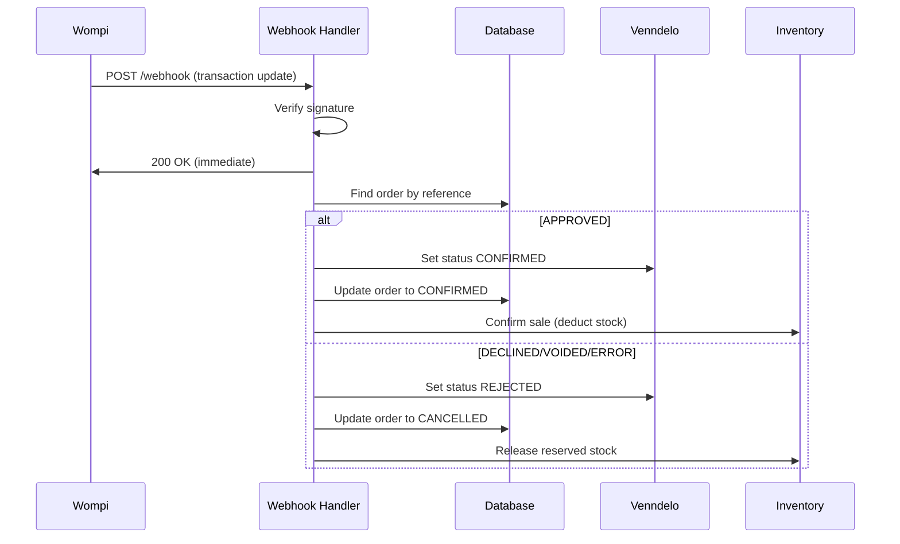

## Overview

Wompi sends webhook notifications when transaction states change (approved, declined, etc.). The webhook handler verifies signature integrity, updates order status, and manages inventory.

**Endpoint:** `POST /api/wompi/webhook`

## Webhook Flow



## Webhook Request

### Headers

<ParamField header="Content-Type" type="string" required>
  Must be `application/json`
</ParamField>

### Body Parameters

<ParamField body="data" type="object" required>
  Transaction data container
  
  <Expandable title="Transaction Object">
    <ParamField body="data.transaction.id" type="string">
      Unique transaction ID from Wompi
    </ParamField>
    
    <ParamField body="data.transaction.reference" type="string">
      Order reference (e.g., `KAIU-12345`)
    </ParamField>
    
    <ParamField body="data.transaction.amount_in_cents" type="number">
      Transaction amount in cents
    </ParamField>
    
    <ParamField body="data.transaction.status" type="string">
      Transaction status: `APPROVED`, `DECLINED`, `VOIDED`, `ERROR`, or `PENDING`
    </ParamField>
  </Expandable>
</ParamField>

<ParamField body="signature" type="object" required>
  Integrity signature object
  
  <ParamField body="signature.checksum" type="string">
    HMAC-SHA256 checksum for verification
  </ParamField>
</ParamField>

<ParamField body="timestamp" type="number" required>
  Unix timestamp of the webhook event
</ParamField>

### Example Webhook Payload

```json
{
  "data": {
    "transaction": {
      "id": "12345-1677649200-wompi",
      "reference": "KAIU-12345",
      "amount_in_cents": 50000,
      "status": "APPROVED",
      "customer_email": "customer@example.com",
      "currency": "COP"
    }
  },
  "signature": {
    "checksum": "9f86d081884c7d659a2feaa0c55ad015a3bf4f1b2b0b822cd15d6c15b0f00a08"
  },
  "timestamp": 1677649200
}
```

## Signature Verification

Wompi signs all webhooks with HMAC-SHA256 to ensure authenticity.

```javascript webhook.js:15-34
const { data, signature, timestamp } = req.body;

if (!data || !signature || !timestamp) {
    console.error("Webhook inválido: Datos incompletos");
    return res.status(400).json({ error: "Datos incompletos" });
}

const { id, reference, amount_in_cents, status } = data.transaction;

// Verify Integrity
const secret = process.env.WOMPI_INTEGRITY_SECRET;
if (!secret) return res.status(500).json({ error: "Configuración incompleta" });

const integrityString = `${id}${status}${amount_in_cents}${timestamp}${secret}`;
const generatedSignature = crypto.createHash('sha256').update(integrityString).digest('hex');

if (generatedSignature !== signature.checksum) {
    console.error("Error Integridad Wompi");
    return res.status(400).json({ error: "Integridad fallida" });
}
```

### Signature Formula

```
HMAC-SHA256(transactionId + status + amountInCents + timestamp + integritySecret)
```

<Warning>
  **Always verify the signature** before processing webhooks to prevent fraudulent transaction updates.
</Warning>

## Response Strategy

The webhook handler uses a **fire-and-forget** pattern to prevent Wompi timeouts.

```javascript webhook.js:36-46
// 2. Respond IMMEDIATELY to Wompi
res.status(200).json({ success: true });

// 3. Process Business Logic Asynchronously
processOrderAsync(req.body).catch(err => {
    console.error("❌ CRITICAL: Error procesando orden en background:", err);
});
```

<Info>
  This pattern responds to Wompi within milliseconds, then processes the order in the background. Works well on persistent servers (Express) but may require queue systems on serverless platforms.
</Info>

## Order Processing

### Finding Orders

Orders are looked up by reference (PIN) or external ID:

```javascript webhook.js:64-84
const pinStr = reference.split('-')[1]; // KAIU-12345 -> 12345
const pin = parseInt(pinStr, 10);

let dbOrder = null;
if (!isNaN(pin)) {
    dbOrder = await prisma.order.findFirst({
        where: { readableId: pin },
        include: { items: true }
    });
}

// Fallback: Try externalId
if (!dbOrder) {
    dbOrder = await prisma.order.findFirst({
        where: { externalId: pinStr },
        include: { items: true }
    });
}

if (!dbOrder) {
    console.warn(`⚠️ Orden DB no encontrada para referencia ${reference}`);
    return;
}
```

### Approved Payments

When `status === 'APPROVED'`:

```javascript webhook.js:110-124
if (status === 'APPROVED') {
    console.log("💰 PAGO APROBADO -> Confirmando Orden");
    
    // 1. Venndelo -> CONFIRMED
    await updateVenndeloStatus(venndeloId, 'CONFIRMED');
    
    // 2. DB -> STATUS: CONFIRMED
    await prisma.order.update({
        where: { id: dbOrder.id },
        data: { status: 'CONFIRMED' }
    });
    
    // 3. Inventory -> Confirm Sale
    await InventoryService.confirmSale(dbOrder.items);
    console.log("📦 Inventario actualizado y orden confirmada.");
}
```

**Actions:**
1. Update Venndelo order status to `CONFIRMED`
2. Update local database order to `CONFIRMED`
3. Deduct items from inventory (convert reservation to sale)

### Declined/Failed Payments

When `status === 'DECLINED' | 'VOIDED' | 'ERROR'`:

```javascript webhook.js:125-139
else if (['DECLINED', 'VOIDED', 'ERROR'].includes(status)) {
    console.log(`🚫 PAGO RECHAZADO (${status}) -> Cancelando Orden`);
    
    // 1. Venndelo -> REJECTED
    await updateVenndeloStatus(venndeloId, 'REJECTED');

    // 2. DB -> STATUS: CANCELLED
    await prisma.order.update({
        where: { id: dbOrder.id },
        data: { status: 'CANCELLED' }
    });

    // 3. Inventory -> Release Stock
    await InventoryService.releaseReserve(dbOrder.items);
    console.log("♻️ Stock liberado.");
}
```

**Actions:**
1. Update Venndelo order status to `REJECTED`
2. Update local database order to `CANCELLED`
3. Release reserved inventory back to available stock

## Venndelo Integration

Orders are synchronized with Venndelo (fulfillment platform):

```javascript webhook.js:95-108
const updateVenndeloStatus = async (id, newStatus) => {
    if (!id) return;
    try {
        console.log(`📡 Llamando a Venndelo para actualizar status a ${newStatus}...`);
        const vRes = await fetch(`https://api.venndelo.com/v1/admin/orders/${id}/modify-order-confirmation-status`, {
            method: 'POST',
            headers: { 
                'Content-Type': 'application/json', 
                'X-Venndelo-Api-Key': VENNDELO_API_KEY 
            },
            body: JSON.stringify({ confirmation_status: newStatus })
        });
        if(!vRes.ok) console.error("Error respuesta Venndelo:", await vRes.text());
        else console.log("✅ Venndelo actualizado.");
    } catch (e) { 
        console.error("Error Network Venndelo:", e.message); 
    }
};
```

## Inventory Management

### Confirming Sales

```javascript
// From InventoryService
await InventoryService.confirmSale(dbOrder.items);
```

Converts reserved stock to confirmed sales, permanently deducting from inventory.

### Releasing Reservations

```javascript
await InventoryService.releaseReserve(dbOrder.items);
```

Returns reserved stock to available inventory when payments fail.

## Error Handling

### Validation Errors

| Scenario | Status | Response |
|----------|--------|----------|
| Missing `data`, `signature`, or `timestamp` | `400` | `{ "error": "Datos incompletos" }` |
| Invalid signature | `400` | `{ "error": "Integridad fallida" }` |
| Missing `WOMPI_INTEGRITY_SECRET` | `500` | `{ "error": "Configuración incompleta" }` |

### Background Processing Errors

```javascript webhook.js:44-46
processOrderAsync(req.body).catch(err => {
    console.error("❌ CRITICAL: Error procesando orden en background:", err);
});
```

Errors in background processing are logged but **do not affect the webhook response** to Wompi.

<Warning>
  Monitor logs for `CRITICAL` errors as these indicate failed order processing despite successful payment.
</Warning>

## Webhook Registration

Register your webhook URL in Wompi dashboard:

**URL:** `https://api.kaiunaturalliving.com/api/wompi/webhook`

**Events to subscribe:**
- `transaction.updated`

## Testing Webhooks

### Manual Test

```bash
curl -X POST https://api.kaiunaturalliving.com/api/wompi/webhook \
  -H "Content-Type: application/json" \
  -d '{
    "data": {
      "transaction": {
        "id": "test-12345",
        "reference": "KAIU-12345",
        "amount_in_cents": 50000,
        "status": "APPROVED"
      }
    },
    "signature": {
      "checksum": "GENERATE_VALID_SIGNATURE"
    },
    "timestamp": 1677649200
  }'
```

<Note>
  Generate a valid signature using the formula: `SHA256(id + status + amount_in_cents + timestamp + secret)`
</Note>

### Test Signature Generator

```javascript
const crypto = require('crypto');

const id = 'test-12345';
const status = 'APPROVED';
const amount = 50000;
const timestamp = 1677649200;
const secret = process.env.WOMPI_INTEGRITY_SECRET;

const integrityString = `${id}${status}${amount}${timestamp}${secret}`;
const checksum = crypto.createHash('sha256').update(integrityString).digest('hex');

console.log('Checksum:', checksum);
```

## Environment Variables

<ParamField path="WOMPI_INTEGRITY_SECRET" type="string" required>
  Secret key for webhook signature verification
</ParamField>

<ParamField path="VENNDELO_API_KEY" type="string" required>
  API key for Venndelo fulfillment integration
</ParamField>

## Monitoring

Key log messages to monitor:

```bash
---- WOMPI WEBHOOK RECEIVED ----
💰 PAGO APROBADO -> Confirmando Orden
📡 Llamando a Venndelo para actualizar status a CONFIRMED...
✅ Venndelo actualizado.
📦 Inventario actualizado y orden confirmada.
```

```bash
🚫 PAGO RECHAZADO (DECLINED) -> Cancelando Orden
♻️ Stock liberado.
```

```bash
❌ CRITICAL: Error procesando orden en background: [error details]
```

## Security Best Practices

1. **Always verify signatures** before processing
2. **Use HTTPS** to prevent man-in-the-middle attacks
3. **Validate transaction amounts** against database records
4. **Log all webhook events** for audit trails
5. **Implement idempotency** to handle duplicate webhooks
6. **Rate limit webhook endpoint** to prevent abuse

## Next Steps

<CardGroup cols={2}>
  <Card title="Wompi Integration" icon="credit-card" href="/api/payments/wompi-integration">
    Learn about signature generation for checkout
  </Card>
  <Card title="Wompi Documentation" icon="book" href="https://docs.wompi.co/docs/en/eventos-webhook">
    Official Wompi webhook documentation
  </Card>
</CardGroup>