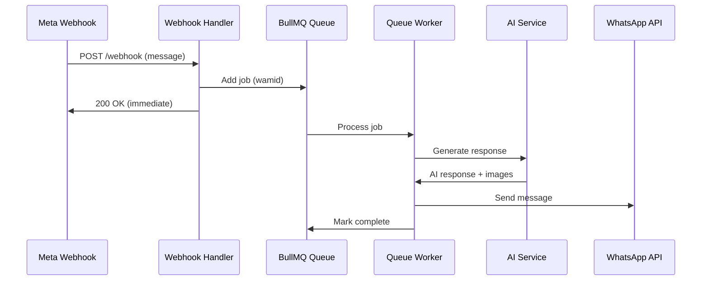

## Overview

KAIU uses **BullMQ** with Redis for reliable asynchronous message processing. This prevents webhook timeouts and enables advanced features like rate limiting, retries, and job deduplication.

**Queue Name:** `whatsapp-ai`

## Architecture



## Queue Configuration

### Redis Connection

```javascript queue.js:17-28
const redisUrl = process.env.REDIS_URL;
const redisOpts = { maxRetriesPerRequest: null };

if (!redisUrl) {
    redisOpts.host = process.env.REDIS_HOST || 'localhost';
    redisOpts.port = process.env.REDIS_PORT || 6379;
    redisOpts.password = process.env.REDIS_PASSWORD;
}

const queueConnection = redisUrl ? new IORedis(redisUrl, redisOpts) : new IORedis(redisOpts);
const workerConnection = redisUrl ? new IORedis(redisUrl, redisOpts) : new IORedis(redisOpts);
```

<Note>
  BullMQ requires **separate Redis connections** for queue and worker to avoid connection conflicts.
</Note>

### Queue Initialization

```javascript queue.js:30
export const whatsappQueue = new Queue('whatsapp-ai', { connection: queueConnection });
```

## Adding Jobs to Queue

Jobs are added from the webhook handler with deduplication to prevent duplicate processing.

```javascript webhook.js:89-97
await whatsappQueue.add('process-message', {
    wamid,
    from: message.from,
    text: message.text.body,
    timestamp: message.timestamp
}, {
    jobId: wamid, // Deduplication via BullMQ
    removeOnComplete: true
});
```

### Job Options

<ParamField path="jobId" type="string">
  Uses the WhatsApp message ID (wamid) as job ID for **automatic deduplication**. If Meta sends duplicate webhooks, BullMQ ignores them.
</ParamField>

<ParamField path="removeOnComplete" type="boolean">
  Set to `true` to automatically clean up completed jobs and save Redis memory.
</ParamField>

## Worker Implementation

### Worker Configuration

```javascript queue.js:35-211
export const worker = new Worker('whatsapp-ai', async job => {
    const { wamid, from, text } = job.data;
    console.log(`⚙️ Processing Job: ${job.id} - ${text}`);

    try {
        // Processing logic...
    } catch (error) {
        console.error(`❌ Job Failed: ${error.message}`);
        throw error;
    }
}, { 
    connection: workerConnection,
    limiter: {
        max: 10, // Max 10 processing jobs at a time
        duration: 1000
    },
    settings: {
        backoffStrategy: 'exponential'
    }
});
```

### Rate Limiting

<ParamField path="limiter.max" type="number" default="10">
  Maximum number of concurrent jobs being processed
</ParamField>

<ParamField path="limiter.duration" type="number" default="1000">
  Time window in milliseconds for the rate limit
</ParamField>

<Info>
  Current configuration: **10 jobs per second** to prevent API rate limits and manage AI processing costs.
</Info>

### Retry Strategy

```javascript queue.js:208-210
settings: {
    backoffStrategy: 'exponential'
}
```

Failed jobs retry with exponential backoff to handle temporary failures (network issues, API rate limits, etc.).

## Message Processing Pipeline

### 1. Session Management

```javascript queue.js:40-54
let session = await prisma.whatsAppSession.findUnique({ where: { phoneNumber: from } });

if (!session) {
    session = await prisma.whatsAppSession.create({
        data: { 
            phoneNumber: from, 
            isBotActive: true, 
            expiresAt: new Date(Date.now() + 24 * 60 * 60 * 1000),
            sessionContext: { history: [] } 
        }
    });
    // Emit New Session
    if (io) io.emit('session_new', { id: session.id, phone: from, time: session.updatedAt });
}
```

Creates a new session if none exists, with **24-hour expiration** and empty conversation history.

### 2. Bot Status Check

```javascript queue.js:56-59
if (!session.isBotActive) {
    console.log(`⏸️ Bot inactive for ${from}. Skipping.`);
    return;
}
```

Skips processing if bot was disabled (e.g., after handover to human agent).

### 3. PII Redaction

```javascript queue.js:66-71
const cleanText = redactPII(text);

const userMsg = { role: 'user', content: cleanText };
history.push(userMsg);
```

<Warning>
  Personal Identifiable Information (PII) is **redacted before storing** in conversation history for privacy compliance.
</Warning>

### 4. Real-time Dashboard Updates

```javascript queue.js:74-80
if (io) {
    io.to(`session_${session.id}`).emit('new_message', { 
        sessionId: session.id, 
        message: { role: 'user', content: text, time: "Just now" } 
    });
    io.emit('chat_list_update', { sessionId: session.id });
}
```

Emits Socket.IO events for real-time dashboard updates.

### 5. Handover Detection

```javascript queue.js:86-116
const HANDOVER_KEYWORDS = /\b(humano|agente|asesor|persona|queja|reclamo|ayuda|contactar|hablar con alguien)\b/i;

if (HANDOVER_KEYWORDS.test(text)) {
    console.log(`🚨 Handover triggered for ${from} by text: "${text}"`);
    
    await prisma.whatsAppSession.update({
        where: { id: session.id },
        data: { 
            isBotActive: false,
            handoverTrigger: "KEYWORD_DETECTED",
            sessionContext: { ...session.sessionContext, history }
        }
    });

    if (io) io.emit('session_update', { id: session.id, status: 'handover' });

    await axios.post(
        `https://graph.facebook.com/v21.0/${process.env.WHATSAPP_PHONE_ID}/messages`,
        {
            messaging_product: "whatsapp",
            to: from,
            text: { body: "Te estoy transfiriendo con un asesor humano. Un momento por favor." }
        },
        { headers: { 'Authorization': `Bearer ${process.env.WHATSAPP_ACCESS_TOKEN}`, 'Content-Type': 'application/json' } }
    );
    
    return; // STOP AI PROCESSING
}
```

Detects keywords indicating the user wants human assistance and disables the bot.

### 6. AI Response Generation

```javascript queue.js:119
const aiResponse = await generateSupportResponse(text, history);
```

Generates AI response using RAG (Retrieval Augmented Generation) with conversation history.

### 7. Image Extraction

```javascript queue.js:121-145
let finalText = aiResponse.text;
const imageRegex = /\[SEND_IMAGE:\s*([^\]]+)\]/g;
let match;
const imageIds = [];

while ((match = imageRegex.exec(finalText)) !== null) {
    imageIds.push(match[1]);
}

// Remove tags from text
finalText = finalText.replace(imageRegex, '')
                     .replace(/<[^>]+>/g, '')
                     .trim();

// Fetch image URLs from database
const imageUrls = [];
for (const pid of imageIds) {
    const product = await prisma.product.findUnique({ where: { id: pid.trim() } });
    if (product && product.images && product.images.length > 0) {
        const rawUrl = product.images[0];
        const cleanUrl = rawUrl.startsWith('http') ? rawUrl : `${process.env.BASE_URL}${rawUrl}`;
        imageUrls.push(cleanUrl);
    }
}
```

Extracts `[SEND_IMAGE:product_id]` tags from AI responses and converts them to actual image URLs.

### 8. Send Response

```javascript queue.js:169-194
// Send text message
if (finalText) {
    await axios.post(
        `https://graph.facebook.com/v21.0/${process.env.WHATSAPP_PHONE_ID}/messages`,
        {
            messaging_product: "whatsapp",
            to: from,
            text: { body: finalText }
        },
        { headers: { 'Authorization': `Bearer ${process.env.WHATSAPP_ACCESS_TOKEN}`, 'Content-Type': 'application/json' } }
    );
}

// Send images separately
for (const cleanUrl of imageUrls) {
    await axios.post(
        `https://graph.facebook.com/v21.0/${process.env.WHATSAPP_PHONE_ID}/messages`,
        {
            messaging_product: "whatsapp",
            to: from,
            type: "image",
            image: { link: cleanUrl }
        },
        { headers: { 'Authorization': `Bearer ${process.env.WHATSAPP_ACCESS_TOKEN}`, 'Content-Type': 'application/json' } }
    );
}
```

## Worker Event Handlers

```javascript queue.js:213-219
worker.on('completed', job => {
    console.log(`Job ${job.id} has completed!`);
});

worker.on('failed', (job, err) => {
    console.log(`Job ${job.id} has failed with ${err.message}`);
});
```

## Socket.IO Integration

The worker requires a Socket.IO instance for real-time dashboard updates.

```javascript queue.js:10-15
let io;

export const setIO = (ioInstance) => {
    io = ioInstance;
    console.log("🔌 Socket.IO instance injected into Queue Worker");
};
```

```javascript server.mjs:54-55
app.set('io', io);
setIO(io); // Inject IO into Queue Worker
```

## Environment Variables

<ParamField path="REDIS_URL" type="string">
  Full Redis connection URL (e.g., `redis://localhost:6379`)
</ParamField>

<ParamField path="REDIS_HOST" type="string" default="localhost">
  Redis host (used if REDIS_URL not provided)
</ParamField>

<ParamField path="REDIS_PORT" type="number" default="6379">
  Redis port (used if REDIS_URL not provided)
</ParamField>

<ParamField path="REDIS_PASSWORD" type="string">
  Redis authentication password
</ParamField>

<ParamField path="WHATSAPP_PHONE_ID" type="string" required>
  WhatsApp Business phone number ID from Meta
</ParamField>

<ParamField path="WHATSAPP_ACCESS_TOKEN" type="string" required>
  WhatsApp API access token from Meta
</ParamField>

<ParamField path="BASE_URL" type="string">
  Base URL for constructing product image URLs
</ParamField>

## Performance Considerations

- **Deduplication**: Using `wamid` as `jobId` prevents duplicate processing if Meta sends webhooks multiple times
- **Rate Limiting**: 10 jobs/second prevents API throttling and manages costs
- **Memory Management**: `removeOnComplete: true` prevents Redis memory bloat
- **Exponential Backoff**: Automatic retries with increasing delays for resilience

## Monitoring

Monitor queue health with console logs:

```bash
📥 Queued message from 573001234567: wamid.HBgNNTczMDA...
⚙️ Processing Job: wamid.HBgNNTczMDA... - Hola, necesito ayuda
✅ Job Completed: wamid.HBgNNTczMDA...
```

## Next Steps

<CardGroup cols={2}>
  <Card title="Session Management" icon="comments" href="/api/whatsapp/session-management">
    Learn about session lifecycle and expiration
  </Card>
  <Card title="Webhooks" icon="webhook" href="/api/whatsapp/webhooks">
    Return to webhook documentation
  </Card>
</CardGroup>