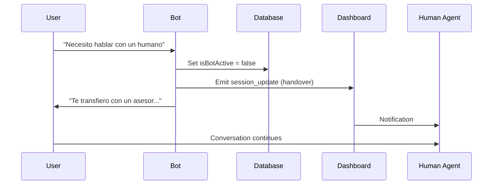

## Overview

KAIU maintains stateful conversation sessions for each WhatsApp user, tracking conversation history, bot status, and handover state. Sessions expire after 24 hours of inactivity.

## Session Schema

```prisma
model WhatsAppSession {
  id               String   @id @default(cuid())
  phoneNumber      String   @unique
  isBotActive      Boolean  @default(true)
  handoverTrigger  String?  // "KEYWORD_DETECTED" | "MANUAL" | null
  expiresAt        DateTime
  sessionContext   Json     // { history: [...] }
  createdAt        DateTime @default(now())
  updatedAt        DateTime @updatedAt
}
```

## Session Creation

Sessions are created automatically when a user sends their first message.

```javascript queue.js:40-54
let session = await prisma.whatsAppSession.findUnique({ where: { phoneNumber: from } });

if (!session) {
    session = await prisma.whatsAppSession.create({
        data: { 
            phoneNumber: from, 
            isBotActive: true, 
            expiresAt: new Date(Date.now() + 24 * 60 * 60 * 1000),
            sessionContext: { history: [] } 
        }
    });
    
    // Emit New Session Event
    if (io) io.emit('session_new', { 
        id: session.id, 
        phone: from, 
        time: session.updatedAt 
    });
}
```

### Session Properties

<ParamField path="phoneNumber" type="string" required>
  User's WhatsApp phone number (unique identifier)
</ParamField>

<ParamField path="isBotActive" type="boolean" default="true">
  Indicates if the AI bot is active for this session. Set to `false` during handover to human agents.
</ParamField>

<ParamField path="expiresAt" type="datetime">
  Session expiration timestamp (24 hours from creation)
</ParamField>

<ParamField path="handoverTrigger" type="string">
  Reason for handover: `KEYWORD_DETECTED` (automatic) or `MANUAL` (dashboard action)
</ParamField>

<ParamField path="sessionContext" type="json">
  JSON object containing conversation history and metadata
  
  ```json
  {
    "history": [
      { "role": "user", "content": "Hola, necesito ayuda" },
      { "role": "assistant", "content": "Hola, estoy aquí para ayudarte" }
    ]
  }
  ```
</ParamField>

## Conversation History

### History Structure

Conversation history is stored in `sessionContext.history` as an array of message objects:

```javascript queue.js:62-72
let history = (session.sessionContext && session.sessionContext.history) 
              ? session.sessionContext.history 
              : [];

const cleanText = redactPII(text);
const userMsg = { role: 'user', content: cleanText };
history.push(userMsg);

// Keep only last 10 messages
if (history.length > 10) history = history.slice(-10);
```

<Info>
  History is **limited to the last 10 messages** to reduce AI context window costs and maintain performance.
</Info>

### PII Redaction

Before storing user messages in history, Personally Identifiable Information (PII) is redacted:

```javascript queue.js:68
const cleanText = redactPII(text);
```

<Warning>
  While PII is redacted in **stored history**, the **original text** is sent to the AI for processing to maintain conversation quality. Only historical context is redacted.
</Warning>

### Adding AI Responses

```javascript queue.js:148-150
const aiMsg = { role: 'assistant', content: finalText || "(Envía una imagen sin texto)" };
if (imageUrls.length > 0) aiMsg.images = imageUrls;
history.push(aiMsg);
```

AI responses can include optional `images` array for product recommendations.

### Saving History

```javascript queue.js:162-167
await prisma.whatsAppSession.update({
    where: { id: session.id },
    data: { 
        sessionContext: { ...session.sessionContext, history } 
    }
});
```

## Bot Status Control

### Checking Bot Status

```javascript queue.js:56-59
if (!session.isBotActive) {
    console.log(`⏸️ Bot inactive for ${from}. Skipping.`);
    return;
}
```

When `isBotActive` is `false`, the worker skips AI processing, allowing human agents to take over.

## Handover Protocol

KAIU implements an intelligent handover system that transfers conversations from AI to human agents.

### Automatic Handover (Keyword Detection)

```javascript queue.js:86-116
const HANDOVER_KEYWORDS = /\b(humano|agente|asesor|persona|queja|reclamo|ayuda|contactar|hablar con alguien)\b/i;

if (HANDOVER_KEYWORDS.test(text)) {
    console.log(`🚨 Handover triggered for ${from} by text: "${text}"`);
    
    // 1. Disable Bot
    await prisma.whatsAppSession.update({
        where: { id: session.id },
        data: { 
            isBotActive: false,
            handoverTrigger: "KEYWORD_DETECTED",
            sessionContext: { ...session.sessionContext, history }
        }
    });

    // 2. Emit Dashboard Update
    if (io) io.emit('session_update', { id: session.id, status: 'handover' });

    // 3. Send Transition Message
    await axios.post(
        `https://graph.facebook.com/v21.0/${process.env.WHATSAPP_PHONE_ID}/messages`,
        {
            messaging_product: "whatsapp",
            to: from,
            text: { body: "Te estoy transfiriendo con un asesor humano. Un momento por favor." }
        },
        { headers: { 'Authorization': `Bearer ${process.env.WHATSAPP_ACCESS_TOKEN}`, 'Content-Type': 'application/json' } }
    );
    
    console.log(`✅ Handover executed for ${from}`);
    return; // STOP AI PROCESSING
}
```

### Handover Keywords (Spanish)

The following keywords trigger automatic handover:

- `humano` - human
- `agente` - agent
- `asesor` - advisor
- `persona` - person
- `queja` - complaint
- `reclamo` - claim
- `ayuda` - help
- `contactar` - contact
- `hablar con alguien` - talk to someone

<Note>
  Keywords are case-insensitive and use word boundary matching to avoid false positives.
</Note>

### Handover Flow



### Manual Handover

Agents can manually disable the bot from the dashboard:

```javascript
// Dashboard action
await prisma.whatsAppSession.update({
    where: { id: sessionId },
    data: { 
        isBotActive: false,
        handoverTrigger: "MANUAL"
    }
});
```

## Real-time Dashboard Events

The session system emits Socket.IO events for real-time dashboard updates.

### New Session Event

```javascript queue.js:53
if (io) io.emit('session_new', { id: session.id, phone: from, time: session.updatedAt });
```

Emitted when a new session is created.

### New Message Event

```javascript queue.js:74-80
if (io) {
    io.to(`session_${session.id}`).emit('new_message', { 
        sessionId: session.id, 
        message: { role: 'user', content: text, time: "Just now" } 
    });
    io.emit('chat_list_update', { sessionId: session.id });
}
```

Emitted when new messages (user or AI) are added to a session.

### Session Update Event

```javascript queue.js:101
if (io) io.emit('session_update', { id: session.id, status: 'handover' });
```

Emitted when session status changes (e.g., handover triggered).

### Joining Session Rooms

Dashboard clients join session-specific Socket.IO rooms:

```javascript server.mjs:103-106
socket.on('join_session', (sessionId) => {
    socket.join(`session_${sessionId}`);
    console.log(`Socket ${socket.id} joined session_${sessionId}`);
});
```

## Session Expiration

Sessions expire **24 hours** after creation:

```javascript queue.js:48
expiresAt: new Date(Date.now() + 24 * 60 * 60 * 1000)
```

<Warning>
  Expired sessions should be cleaned up periodically. Consider implementing a cron job to delete sessions where `expiresAt < NOW()`.
</Warning>

### Recommended Cleanup Job

```javascript
// Run daily
import { prisma } from './db.js';

export async function cleanupExpiredSessions() {
    const result = await prisma.whatsAppSession.deleteMany({
        where: {
            expiresAt: { lt: new Date() }
        }
    });
    
    console.log(`🧹 Cleaned up ${result.count} expired sessions`);
}
```

## Best Practices

### Context Window Management

Keeping only the last 10 messages reduces:
- AI API costs
- Database storage
- Response latency

### Privacy Compliance

PII redaction ensures:
- GDPR compliance
- Data minimization
- Secure storage

### Handover UX

Immediate response (`"Te estoy transfiriendo..."`) ensures:
- User knows handover is happening
- No confusion during transition
- Professional experience

## Environment Variables

<ParamField path="WHATSAPP_PHONE_ID" type="string" required>
  WhatsApp Business phone number ID for sending messages
</ParamField>

<ParamField path="WHATSAPP_ACCESS_TOKEN" type="string" required>
  WhatsApp API access token
</ParamField>

## Next Steps

<CardGroup cols={2}>
  <Card title="Webhooks" icon="webhook" href="/api/whatsapp/webhooks">
    Learn about webhook endpoints
  </Card>
  <Card title="Queue System" icon="gears" href="/api/whatsapp/queue-system">
    Understand message processing
  </Card>
</CardGroup>