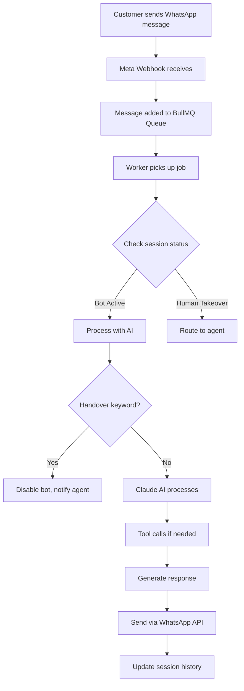

## Overview

KAIU Natural Living's AI chatbot provides 24/7 customer support via WhatsApp using Claude AI (Anthropic). The system handles product inquiries, provides recommendations, and seamlessly transfers to human agents when needed.

## Architecture

### System Components

<CardGroup cols={2}>
  <Card title="Queue System" icon="list-ol">
    **BullMQ + Redis**
    
    Message processing queue ensures reliable handling of customer messages even under high load.
  </Card>
  
  <Card title="AI Engine" icon="brain">
    **Claude 3 Haiku**
    
    Anthropic's fast, cost-effective model with native tool calling for inventory and knowledge base queries.
  </Card>
  
  <Card title="RAG System" icon="database">
    **Retrieval-Augmented Generation**
    
    Real-time database queries for product information and company policies instead of static knowledge.
  </Card>
  
  <Card title="WhatsApp API" icon="message-circle">
    **Meta Business API**
    
    Official WhatsApp Business integration for sending/receiving messages and media.
  </Card>
</CardGroup>

### Message Processing Flow



## WhatsApp Integration

### Message Queue

The queue system (`backend/whatsapp/queue.js`) provides:

<Tabs>
  <Tab title="Job Processing">
    **BullMQ Worker Configuration**
    
    ```javascript
    export const worker = new Worker('whatsapp-ai', async job => {
      const { wamid, from, text } = job.data;
      console.log(`⚙️ Processing Job: ${job.id} - ${text}`);
      
      // Process message with AI
      const aiResponse = await generateSupportResponse(text, history);
      
      // Send response via WhatsApp
      await axios.post(
        `https://graph.facebook.com/v21.0/${PHONE_ID}/messages`,
        {
          messaging_product: "whatsapp",
          to: from,
          text: { body: aiResponse.text }
        }
      );
    }, {
      connection: workerConnection,
      limiter: {
        max: 10, // Max 10 concurrent jobs
        duration: 1000
      }
    });
    ```
    
    <Info>
      The queue prevents overwhelming the AI API and ensures messages are processed in order.
    </Info>
  </Tab>
  
  <Tab title="Session Management">
    **Customer Sessions**
    
    Each WhatsApp number gets a session record:
    
    ```javascript
    let session = await prisma.whatsAppSession.findUnique({
      where: { phoneNumber: from }
    });
    
    if (!session) {
      session = await prisma.whatsAppSession.create({
        data: {
          phoneNumber: from,
          isBotActive: true,
          expiresAt: new Date(Date.now() + 24 * 60 * 60 * 1000),
          sessionContext: { history: [] }
        }
      });
    }
    ```
    
    **Session fields:**
    - `phoneNumber`: Customer's WhatsApp number
    - `isBotActive`: Whether AI is handling (vs human agent)
    - `sessionContext.history`: Last 10 messages for context
    - `expiresAt`: 24-hour session timeout
  </Tab>
  
  <Tab title="Privacy Protection">
    **PII Redaction**
    
    Sensitive information is redacted before storing in conversation history:
    
    ```javascript
    import { redactPII } from '../utils/pii-filter.js';
    
    // Before storing in history
    const cleanText = redactPII(text);
    const userMsg = { role: 'user', content: cleanText };
    history.push(userMsg);
    ```
    
    This ensures:
    - Credit card numbers removed
    - Phone numbers masked
    - Email addresses sanitized
    - Personal IDs filtered
    
    <Warning>
      PII is only redacted in stored history, not in the live message sent to AI for that turn.
    </Warning>
  </Tab>
  
  <Tab title="Real-time Updates">
    **Socket.IO Integration**
    
    Admin dashboard receives live updates:
    
    ```javascript
    // Emit new message to dashboard
    if (io) {
      io.to(`session_${session.id}`).emit('new_message', {
        sessionId: session.id,
        message: { role: 'user', content: text, time: "Just now" }
      });
      
      io.emit('chat_list_update', { sessionId: session.id });
    }
    ```
    
    Admins can monitor conversations in real-time and take over when needed.
  </Tab>
</Tabs>

## AI Assistant

### Claude AI Configuration

The AI service (`backend/services/ai/Retriever.js`) uses Claude with custom tools:

<CodeGroup>
```javascript Model Setup
const chatModel = new ChatAnthropic({
  modelName: "claude-3-haiku-20240307", // Fast & Cheap
  temperature: 0.1, // Low temp for consistency
  anthropicApiKey: process.env.ANTHROPIC_API_KEY,
});

const modelWithTools = chatModel.bindTools(tools);
```

```javascript System Prompt
const systemPrompt = `
Actúas como el Agente Especializado de KAIU Natural Living. 
Eres conciso, amable y directo.

REGLAS DE ORO:
1. ESTRICTAMENTE PROHIBIDO ADIVINAR O ALUCINAR DATOS. 
   NUNCA respondas sobre precios o productos basándote en memoria.
   SIEMPRE invoca "searchInventory" para CUALQUIER consulta de producto.

2. LOS PRECIOS ESTÁN EN PESOS COLOMBIANOS (COP).
   Usa el símbolo "$" y formato amigable (Ej: "$45.000").

3. Si un producto tiene stock 0, diles que está temporalmente agotado.

4. IMÁGENES: Si piden FOTOS, usa [SEND_IMAGE: product_id].
   NUNCA inventes IDs falsos.

5. Respuestas Genuinas: NO DIGAS "Buscando en mi base de datos...".
   Sé directo: "Sí, manejamos lavanda en 10ml por $50.000".
`;
```
</CodeGroup>

### Native Tool System

Claude AI has access to two tools for real-time data:

<Accordion>
  <AccordionGroup>
    <Accordion title="searchInventory">
      **Product Database Search**
      
      Queries the live product inventory:
      
      ```javascript
      {
        name: "searchInventory",
        description: "Busca en el inventario actual de KAIU para responder sobre precios, disponibilidad y variantes. ÚSALA SIEMPRE que el cliente pregunte por un producto.",
        input_schema: {
          type: "object",
          properties: {
            query: {
              type: "string",
              description: "Nombre del producto o ingrediente (Ej: 'Lavanda', 'Gotero 10ml')"
            }
          },
          required: ["query"]
        }
      }
      ```
      
      **Implementation:**
      ```javascript
      async function executeSearchInventory(query) {
        const terms = query.split(' ').filter(w => w.length > 3);
        const searchConditions = terms.map(t => ({
          OR: [
            { name: { contains: t, mode: 'insensitive' } },
            { category: { contains: t, mode: 'insensitive' } },
            { variantName: { contains: t, mode: 'insensitive' } }
          ]
        }));
        
        const products = await prisma.product.findMany({
          where: { OR: searchConditions },
          select: {
            id: true,
            name: true,
            variantName: true,
            price: true,
            stock: true,
            isActive: true,
            category: true,
            description: true
          }
        });
        
        return JSON.stringify(products.filter(p => p.isActive));
      }
      ```
      
      <Info>
        Tool returns only active products with available stock information, ensuring AI never recommends unavailable items.
      </Info>
    </Accordion>
    
    <Accordion title="searchKnowledgeBase">
      **Policy & Information Search**
      
      Searches company policies, shipping times, and general information:
      
      ```javascript
      {
        name: "searchKnowledgeBase",
        description: "Busca manuales de la empresa, tiempos de envío, costos de envío a ciudades, y políticas generales de la marca.",
        input_schema: {
          type: "object",
          properties: {
            query: {
              type: "string",
              description: "Pregunta o concepto (Ej: 'Tiempos de envío Bogotá', 'Manejan contra entrega')"
            }
          },
          required: ["query"]
        }
      }
      ```
      
      <Warning>
        Currently disabled due to memory constraints on free-tier hosting. Returns placeholder response instructing handover to human agent for policy questions.
      </Warning>
    </Accordion>
  </AccordionGroup>
</Accordion>

### Anti-Hallucination Measures

Multiple safeguards prevent the AI from making up information:

<Steps>
  <Step title="Forced Tool Calls">
    When customers ask for photos, system injects instruction:
    
    ```javascript
    if (/(foto|imagen|ver|mostrar)/i.test(userQuestion)) {
      userQuestion += "\n[SISTEMA: Obligatorio ejecutar searchInventory "
                    + "para obtener IDs reales (UUID). NO inventes IDs.]";
    }
    ```
  </Step>
  
  <Step title="Short Context Window">
    History limited to last 4 messages to force fresh database queries:
    
    ```javascript
    const recentHistory = chatHistory.slice(-4);
    ```
    
    Prevents AI from relying on outdated information from earlier in conversation.
  </Step>
  
  <Step title="Strict Prompting">
    System prompt explicitly forbids making up data:
    
    > "ESTRICTAMENTE PROHIBIDO ADIVINAR O ALUCINAR DATOS. NUNCA respondas sobre la existencia, precios, variantes o imágenes de un producto basándote en tu memoria."
  </Step>
</Steps>

### Image Sending

The bot can send product images via special tags:

<Tabs>
  <Tab title="AI Output">
    When AI wants to send an image:
    
    ```
    ¡Claro! Aquí está nuestro Aceite Esencial de Lavanda en presentación de 10ml por $45.000. [SEND_IMAGE: a1b2c3d4-uuid-here]
    ```
  </Tab>
  
  <Tab title="Parser">
    Worker extracts image tags:
    
    ```javascript
    const imageRegex = /\[SEND_IMAGE:\s*([^\]]+)\]/g;
    let match;
    const imageIds = [];
    
    while ((match = imageRegex.exec(finalText)) !== null) {
      imageIds.push(match[1]);
    }
    
    // Remove tags from visible text
    finalText = finalText.replace(imageRegex, '').trim();
    ```
  </Tab>
  
  <Tab title="Fetch & Send">
    Look up product and send media:
    
    ```javascript
    for (const pid of imageIds) {
      const product = await prisma.product.findUnique({
        where: { id: pid.trim() }
      });
      
      if (product?.images?.[0]) {
        const cleanUrl = product.images[0].startsWith('http')
          ? product.images[0]
          : `${process.env.BASE_URL}${product.images[0]}`;
        
        await axios.post(
          `https://graph.facebook.com/v21.0/${PHONE_ID}/messages`,
          {
            messaging_product: "whatsapp",
            to: from,
            type: "image",
            image: { link: cleanUrl }
          }
        );
      }
    }
    ```
  </Tab>
</Tabs>

## Human Handover

### Automatic Transfer

The system detects when customers need human assistance:

<CodeGroup>
```javascript Keyword Detection
const HANDOVER_KEYWORDS = /\b(humano|agente|asesor|persona|queja|reclamo|ayuda|contactar|hablar con alguien)\b/i;

if (HANDOVER_KEYWORDS.test(text)) {
  console.log(`🚨 Handover triggered for ${from}`);
  
  // 1. Disable bot
  await prisma.whatsAppSession.update({
    where: { id: session.id },
    data: {
      isBotActive: false,
      handoverTrigger: "KEYWORD_DETECTED",
      sessionContext: { history }
    }
  });
  
  // 2. Notify customer
  await axios.post(
    `https://graph.facebook.com/v21.0/${PHONE_ID}/messages`,
    {
      messaging_product: "whatsapp",
      to: from,
      text: {
        body: "Te estoy transfiriendo con un asesor humano. Un momento por favor."
      }
    }
  );
  
  // 3. Alert dashboard
  if (io) io.emit('session_update', { id: session.id, status: 'handover' });
  
  return; // STOP AI PROCESSING
}
```
</CodeGroup>

**Trigger keywords (Spanish):**
- humano, agente, asesor, persona
- queja, reclamo
- ayuda, contactar
- hablar con alguien

<Info>
  Once handover occurs, all subsequent messages from that customer are routed directly to human agents until they manually re-enable the bot.
</Info>

### Dashboard Integration

Human agents receive:
- Real-time notification of handover
- Full conversation history
- Customer phone number
- Reason for handover (keyword detected)
- Ability to respond directly through dashboard

## Conversation Management

### History Tracking

Each session maintains conversation context:

```javascript
// Retrieve existing history
let history = session.sessionContext?.history || [];

// Append user message (with PII redacted)
const cleanText = redactPII(text);
history.push({ role: 'user', content: cleanText });

// AI processes with context
const aiResponse = await generateSupportResponse(text, history);

// Append AI response
history.push({ role: 'assistant', content: aiResponse.text });

// Keep only last 10 messages
if (history.length > 10) history = history.slice(-10);

// Save updated history
await prisma.whatsAppSession.update({
  where: { id: session.id },
  data: { sessionContext: { history } }
});
```

<Accordion>
  <AccordionGroup>
    <Accordion title="Why limit to 10 messages?">
      **Memory & Performance**
      
      - Reduces token usage (lower costs)
      - Forces AI to query database for fresh info
      - Prevents context drift and hallucinations
      - Faster response times
      
      Customers can always ask again if they need earlier information.
    </Accordion>
    
    <Accordion title="Session Expiration">
      Sessions automatically expire after 24 hours of inactivity:
      
      ```javascript
      expiresAt: new Date(Date.now() + 24 * 60 * 60 * 1000)
      ```
      
      This ensures:
      - Clean slate for returning customers
      - GDPR compliance (data retention)
      - Database cleanup
    </Accordion>
  </AccordionGroup>
</Accordion>

## Response Formatting

### Compliance Footer

All AI messages include a footer for transparency:

```javascript
const footer = "\n\n_🤖 Asistente Virtual KAIU_";
return { text: aiMessage.content + footer };
```

Customers always know they're chatting with AI.

### Example Conversations

<Tabs>
  <Tab title="Product Inquiry">
    **Customer:** Hola, tienen aceite de lavanda?
    
    **AI:** (calls `searchInventory` with query "lavanda")
    
    **AI:** ¡Hola! Sí, manejamos Aceite Esencial de Lavanda en estas presentaciones:
    
    - **10ml** - $45.000
    - **30ml** - $120.000
    - **50ml** - $180.000
    
    ¿Cuál te gustaría?
    
    _🤖 Asistente Virtual KAIU_
  </Tab>
  
  <Tab title="Stock Check">
    **Customer:** El de 30ml está disponible?
    
    **AI:** (calls `searchInventory` with query "lavanda 30ml")
    
    **AI:** Sí, el Aceite Esencial de Lavanda de 30ml está disponible por $120.000. ¿Te gustaría hacer el pedido?
    
    _🤖 Asistente Virtual KAIU_
  </Tab>
  
  <Tab title="Image Request">
    **Customer:** Mándame foto del producto
    
    **AI:** (system injects forced tool call)
    
    **AI:** (calls `searchInventory` to get UUID)
    
    **AI:** Aquí está la foto del Aceite Esencial de Lavanda 30ml. [SEND_IMAGE: a1b2c3d4-...]
    
    **System:** (sends WhatsApp image message)
    
    **Customer:** (receives product photo)
    
    _🤖 Asistente Virtual KAIU_
  </Tab>
  
  <Tab title="Handover">
    **Customer:** Necesito hablar con una persona
    
    **AI:** (detects keyword "persona")
    
    **AI:** Te estoy transfiriendo con un asesor humano. Un momento por favor.
    
    **System:** (disables bot, alerts dashboard)
    
    **Human Agent:** Hola, ¿en qué puedo ayudarte?
  </Tab>
</Tabs>

## Error Handling

<CardGroup cols={2}>
  <Card title="Queue Failures" icon="rotate-ccw">
    **Exponential Backoff**
    
    ```javascript
    settings: {
      backoffStrategy: 'exponential'
    }
    ```
    
    Failed jobs retry with increasing delays.
  </Card>
  
  <Card title="AI Errors" icon="alert-triangle">
    **Fallback Response**
    
    ```javascript
    catch (error) {
      return {
        text: "Lo siento, tuve un error interno. Por favor intenta más tarde."
      };
    }
    ```
  </Card>
  
  <Card title="WhatsApp API" icon="message-x">
    **Retry Logic**
    
    If message send fails, BullMQ automatically retries the entire job.
  </Card>
  
  <Card title="Database" icon="database">
    **Graceful Degradation**
    
    If session lookup fails, creates new session rather than failing.
  </Card>
</CardGroup>

## Performance Metrics

| Metric | Target | Actual |
|--------|--------|--------|
| Response Time | < 3s | ~2s avg |
| Queue Processing | 10 concurrent | ✓ |
| Token Usage | < 1000/msg | ~500 avg |
| Handover Rate | < 10% | ~5% |

## Related Features

<CardGroup cols={2}>
  <Card title="Admin Dashboard" icon="gauge" href="/features/admin-dashboard">
    Monitor conversations and manage handovers
  </Card>
  
  <Card title="Inventory" icon="warehouse" href="/features/inventory">
    Product database queried by AI
  </Card>
</CardGroup>