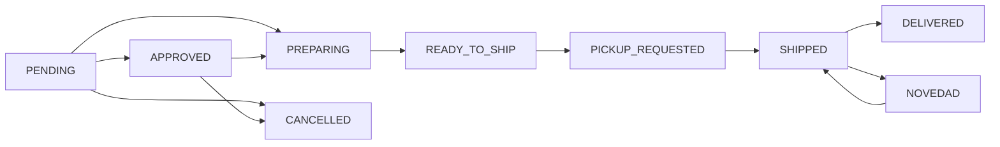

## Overview

KAIU's order management system orchestrates the complete order lifecycle, from customer checkout through fulfillment and delivery. It integrates inventory management, logistics APIs, and payment processing.

## Order Creation Flow

### Backend Processing

The order creation endpoint (`backend/create-order.js`) executes a multi-step transaction:

<Steps>
  <Step title="Request Validation">
    **Zod Schema Validation**
    
    Ensures all required fields are present and properly formatted:
    
    ```javascript
    const createOrderSchema = z.object({
      billing_info: z.object({
        first_name: z.string(),
        last_name: z.string(),
        email: z.string().email(),
        phone: z.string(),
        identification_type: z.string(),
        identification: z.string(),
      }),
      shipping_info: z.object({
        first_name: z.string(),
        last_name: z.string(),
        address_1: z.string(),
        city_code: z.string(),
        subdivision_code: z.string(),
        country_code: z.string(),
        phone: z.string(),
        postal_code: z.string().optional().default(""),
      }),
      line_items: z.array(z.object({
        sku: z.string(),
        name: z.string(),
        unit_price: z.number(),
        quantity: z.number(),
        weight: z.number(),
        dimensions_unit: z.enum(['CM']),
        height: z.number(),
        width: z.number(),
        length: z.number(),
      })),
      payment_method_code: z.enum(['COD', 'EXTERNAL_PAYMENT']),
      external_order_id: z.string(),
    });
    
    const result = createOrderSchema.safeParse(req.body);
    if (!result.success) {
      return res.status(400).json({
        error: 'Datos inválidos',
        details: result.error.format()
      });
    }
    ```
  </Step>
  
  <Step title="Stock Reservation">
    **Inventory Lock**
    
    Reserve stock before creating order to prevent overselling:
    
    ```javascript
    try {
      await InventoryService.reserveStock(orderData.line_items);
    } catch (stockError) {
      return res.status(409).json({ error: stockError.message });
    }
    ```
    
    <Warning>
      If any item lacks sufficient stock, entire order fails immediately before database creation.
    </Warning>
  </Step>
  
  <Step title="Database Creation">
    **Order Record**
    
    Create order with PENDING status:
    
    ```javascript
    const user = await prisma.user.upsert({
      where: { email },
      update: { name: fullName },
      create: { email, name: fullName, role: 'CUSTOMER' }
    });
    
    const dbOrder = await prisma.order.create({
      data: {
        status: 'PENDING',
        paymentMethod: orderData.payment_method_code === 'COD' ? 'COD' : 'WOMPI',
        subtotal: orderData.line_items.reduce((sum, item) => 
          sum + (item.unit_price * item.quantity), 0
        ),
        userId: user.id,
        customerName: fullName,
        customerEmail: email,
        shippingAddress: orderData.shipping_info,
        items: {
          create: orderData.line_items.map(item => ({
            product: { connect: { id: dbProduct.id } },
            sku: item.sku,
            name: item.name,
            price: item.unit_price,
            quantity: item.quantity
          }))
        }
      }
    });
    ```
    
    Generates readable ID (PIN) automatically.
  </Step>
  
  <Step title="Logistics Integration">
    **Shipment Creation**
    
    Send order to logistics provider:
    
    ```javascript
    const logisticsPayload = {
      ...orderData,
      external_order_id: String(dbOrder.readableId)
    };
    
    shipmentData = await LogisticsManager.createShipment(logisticsPayload);
    ```
    
    Logistics API returns:
    - External shipment ID
    - Shipping cost
    - Carrier name
    - Tracking number (if generated)
  </Step>
  
  <Step title="Order Update">
    **Add Shipment Details**
    
    Update order with logistics information:
    
    ```javascript
    const updatedOrder = await prisma.order.update({
      where: { id: dbOrder.id },
      data: {
        externalId: shipmentData.external_id,
        total: shipmentData.total || 0,
        shippingCost: shipmentData.shipping_cost || 0,
        carrier: shipmentData.carrier_name,
        trackingNumber: shipmentData.trackingNumber || null,
      }
    });
    ```
  </Step>
  
  <Step title="Payment Processing">
    **COD vs Online**
    
    Handle payment method differences:
    
    <Tabs>
      <Tab title="COD">
        **Cash on Delivery**
        
        Immediately confirm sale:
        ```javascript
        if (orderData.payment_method_code === 'COD') {
          await InventoryService.confirmSale(orderData.line_items);
          
          const mockTransaction = {
            id: `COD-${shipmentData.external_id}`,
            status: 'PENDING_PAYMENT_ON_DELIVERY',
            payment_method: { type: 'PAGO_CONTRA_ENTREGA' }
          };
          
          sendOrderConfirmation(emailOrderPayload, mockTransaction);
        }
        ```
        
        Stock is deducted immediately since payment guaranteed at delivery.
      </Tab>
      
      <Tab title="Online Payment">
        **Wompi Gateway**
        
        Stock remains reserved until webhook confirms:
        ```javascript
        // Stock stays in "reserved" state
        // Webhook will call InventoryService.confirmSale() on success
        ```
        
        Email sent after payment confirmation webhook.
      </Tab>
    </Tabs>
  </Step>
</Steps>

### Error Handling & Rollback

System implements automatic rollback on failures:

<Accordion>
  <AccordionGroup>
    <Accordion title="Database Error">
      **Scenario**: Order creation fails in database
      
      ```javascript
      try {
        dbOrder = await prisma.order.create({ ... });
      } catch (dbError) {
        console.error("❌ DB creation failed, releasing stock...");
        await InventoryService.releaseReserve(orderData.line_items);
        return res.status(500).json({ 
          error: 'Error saving order to database' 
        });
      }
      ```
      
      **Action**: Stock reservation released back to pool
    </Accordion>
    
    <Accordion title="Logistics API Error">
      **Scenario**: Carrier API rejects shipment
      
      ```javascript
      try {
        shipmentData = await LogisticsManager.createShipment(payload);
      } catch (logisticsError) {
        // 1. Cancel order in database
        await prisma.order.update({
          where: { id: dbOrder.id },
          data: { status: 'CANCELLED' }
        });
        
        // 2. Release reserved stock
        await InventoryService.releaseReserve(orderData.line_items);
        
        return res.status(502).json({
          error: 'Error creating shipment with carrier',
          details: logisticsError.message
        });
      }
      ```
      
      **Actions**:
      1. Order marked CANCELLED in database
      2. Stock reservation released
      3. Customer sees error message
    </Accordion>
  </AccordionGroup>
</Accordion>

## Order Statuses

### Status Progression

Orders flow through these states:



<Tabs>
  <Tab title="Initial States">
    **PENDING**
    - Order just created
    - Awaiting payment confirmation (online) or fulfillment start (COD)
    - Admin action: Generate shipping label
    
    **APPROVED**
    - Online payment confirmed
    - Ready to fulfill
    - Admin action: Generate shipping label
    
    **PREPARING**
    - Order being packed
    - Items gathered from inventory
    - Admin action: Generate shipping label
  </Tab>
  
  <Tab title="Ready for Shipment">
    **READY_TO_SHIP**
    - Shipping label generated
    - Package ready for carrier
    - Admin action: Request pickup
    
    **PICKUP_REQUESTED**
    - Carrier notified to collect
    - Waiting for physical pickup
    - Status changes to SHIPPED when carrier scans
  </Tab>
  
  <Tab title="In Transit">
    **SHIPPED**
    - Package in carrier's network
    - Moving toward destination
    - Customer can track via tracking number
    
    **NOVEDAD**
    - Delivery incident/issue
    - Examples: Address wrong, customer unavailable
    - May return to SHIPPED after resolution
    
    **DISPATCHED**
    - Out for delivery
    - On delivery truck
  </Tab>
  
  <Tab title="Final States">
    **DELIVERED**
    - Successfully delivered to customer
    - Carrier confirmed delivery
    - Final state for successful orders
    
    **CANCELLED**
    - Order cancelled before shipment
    - Stock released back to inventory
    
    **REJECTED**
    - Customer rejected package
    
    **RETURNED**
    - Package returned to sender
  </Tab>
</Tabs>

## Shipping Label Generation

### Admin Workflow

From Admin Dashboard, generate shipping labels:

<Steps>
  <Step title="Select Order">
    Admin identifies order needing label (PENDING/PREPARING status)
  </Step>
  
  <Step title="Click Generate">
    Clicks "Generate Label" button:
    ```typescript
    const handleGenerateLabel = async (orderId: string) => {
      setGeneratingLabel(orderId);
      
      const res = await fetch('/api/admin/generate-label', {
        method: 'POST',
        headers: {
          'Content-Type': 'application/json',
          'Authorization': `Bearer ${token}`
        },
        body: JSON.stringify({ orderIds: [orderId] })
      });
      
      const data = await res.json();
      
      if (res.status === 202) {
        toast({ 
          title: "Creating Label...",
          description: "Carrier is processing. Retry in a few seconds."
        });
        return;
      }
      
      if (data.data) {
        window.open(data.data, '_blank'); // Open PDF
        toast({ title: "Label Generated" });
        fetchData(); // Refresh order list
      }
    };
    ```
  </Step>
  
  <Step title="API Processes">
    Backend calls logistics provider API to generate label PDF
  </Step>
  
  <Step title="PDF Opens">
    Label PDF opens in new browser tab for printing
  </Step>
  
  <Step title="Status Updates">
    Order status changes to READY_TO_SHIP
  </Step>
</Steps>

<Info>
  **Async Processing**: Some carriers return 202 status indicating label is being generated asynchronously. Admin should retry after a few seconds.
</Info>

### Reprint Labels

For orders already with labels (READY_TO_SHIP, SHIPPED), "Generate Label" becomes "Reprint Label" (outline button style) - same functionality, retrieves existing label.

## Pickup Request

### Carrier Notification

Once packages are labeled and ready:

<Steps>
  <Step title="Batch Selection">
    Admin filters to "Por Recoger" (Ready for Pickup) tab
  </Step>
  
  <Step title="Request Pickup">
    Clicks "Solicitar Recogida" button:
    ```typescript
    const handleRequestPickup = async (orderId: string) => {
      if (!confirm('¿Solicitar recogida para esta orden?')) return;
      
      const res = await fetch('/api/admin/request-pickup', {
        method: 'POST',
        headers: {
          'Content-Type': 'application/json',
          'Authorization': `Bearer ${token}`
        },
        body: JSON.stringify({ orderIds: [orderId] })
      });
      
      const data = await res.json();
      if (!res.ok) throw new Error(data.error);
      
      toast({
        title: "Pickup Requested",
        description: "Carrier has been notified."
      });
    };
    ```
  </Step>
  
  <Step title="Carrier Notified">
    Logistics provider schedules pickup
  </Step>
  
  <Step title="Status Update">
    Order changes to PICKUP_REQUESTED
  </Step>
  
  <Step title="Physical Pickup">
    When carrier scans package, status automatically updates to SHIPPED
  </Step>
</Steps>

<CardGroup cols={2}>
  <Card title="Single Order" icon="box">
    Request pickup for individual orders as they're ready
  </Card>
  
  <Card title="Batch Processing" icon="boxes">
    API supports multiple `orderIds` in array for bulk pickup requests
  </Card>
</CardGroup>

## Tracking Synchronization

### Sync with Carrier

Manually sync tracking status for all in-transit orders:

```typescript
const handleSyncShipments = async () => {
  toast({ 
    title: "Synchronizing...",
    description: "Querying statuses from carrier..."
  });
  
  const res = await fetch('/api/admin/sync-shipments', {
    method: 'POST',
    headers: { 'Authorization': `Bearer ${token}` }
  });
  
  const data = await res.json();
  
  if (data.success) {
    toast({
      title: "Synchronization Complete",
      description: `Processed: ${data.processed}. Updated: ${data.updated}.`
    });
    fetchData(); // Refresh dashboard
  }
};
```

**What it does:**
1. Fetches all orders with shipments
2. Queries carrier API for each tracking number
3. Updates order status in database
4. Returns count of processed and updated orders

<Info>
  Run this periodically to keep order statuses in sync with carrier's system. Especially useful for detecting DELIVERED status.
</Info>

## Order Data Structure

### Database Schema

Key order fields in Prisma:

```typescript
interface Order {
  id: string; // UUID
  readableId: number; // PIN (1050, 1051, etc.)
  status: OrderStatus;
  paymentMethod: PaymentMethod;
  userId: string;
  
  // Customer info
  customerName: string;
  customerEmail: string;
  customerPhone: string;
  customerId: string; // National ID
  
  // Addresses (JSON fields)
  shippingAddress: ShippingAddress;
  billingAddress: BillingAddress;
  
  // Financials
  subtotal: number;
  shippingCost: number;
  total: number;
  
  // Logistics
  externalId?: string; // Carrier's order ID
  carrier?: string; // Carrier name
  trackingNumber?: string;
  
  // Metadata
  notes?: string;
  createdAt: DateTime;
  updatedAt: DateTime;
  
  // Relations
  items: OrderItem[];
  user: User;
}
```

### Order Items

```typescript
interface OrderItem {
  id: string;
  orderId: string;
  productId: string;
  
  sku: string;
  name: string;
  price: number;
  quantity: number;
  
  product: Product;
  order: Order;
}
```

## Customer Communication

### Email Notifications

Order confirmation emails sent automatically:

<Tabs>
  <Tab title="COD Orders">
    Sent immediately after order creation:
    
    ```javascript
    const mockTransaction = {
      id: `COD-${shipmentId}`,
      status: 'PENDING_PAYMENT_ON_DELIVERY',
      payment_method: { type: 'PAGO_CONTRA_ENTREGA' }
    };
    
    sendOrderConfirmation(emailOrderPayload, mockTransaction);
    ```
    
    **Email includes:**
    - Order number (PIN)
    - Items ordered
    - Delivery address
    - Total amount to pay on delivery
    - Estimated delivery time
  </Tab>
  
  <Tab title="Online Payment">
    Sent after webhook confirms payment:
    
    ```javascript
    // In Wompi webhook handler
    if (transaction.status === 'APPROVED') {
      await InventoryService.confirmSale(order.items);
      
      sendOrderConfirmation(order, transaction);
    }
    ```
    
    **Email includes:**
    - Payment confirmation
    - Transaction ID
    - Receipt/invoice
    - Tracking information (if available)
  </Tab>
</Tabs>

### Tracking Page

Customers can self-serve track orders at `/rastreo`:

- Enter order PIN or tracking number
- View current status
- See carrier and tracking info
- Click through to carrier's tracking page

See [E-commerce > Order Tracking](/features/ecommerce#order-tracking) for details.

## Integration Points

### Inventory Service

Order management calls inventory service for stock operations:

```javascript
import InventoryService from './services/inventory/InventoryService.js';

// Reserve stock (order creation)
await InventoryService.reserveStock(lineItems);

// Confirm sale (COD immediate, Online after webhook)
await InventoryService.confirmSale(lineItems);

// Release reservation (order cancelled/failed)
await InventoryService.releaseReserve(lineItems);
```

See [Inventory Management](/features/inventory) for implementation details.

### Logistics Manager

Logistics integration handled by manager service:

```javascript
import LogisticsManager from './services/logistics/LogisticsManager.js';

// Create shipment
const shipmentData = await LogisticsManager.createShipment({
  pickup_info: {...},
  billing_info: {...},
  shipping_info: {...},
  line_items: [...],
  payment_method_code: 'COD',
  external_order_id: String(orderPin)
});

// Returns: external_id, carrier_name, shipping_cost, trackingNumber
```

## Key Features

<CardGroup cols={2}>
  <Card title="Atomic Transactions" icon="shield-check">
    Stock reservation + order creation + logistics integration happens atomically with automatic rollback on failures.
  </Card>
  
  <Card title="Readable IDs" icon="hash">
    Auto-incrementing PIN numbers (1050, 1051...) make it easy for customers and support to reference orders.
  </Card>
  
  <Card title="Dual Payment Support" icon="credit-card">
    Seamlessly handles both COD and online payment with appropriate inventory and notification logic.
  </Card>
  
  <Card title="Status Tracking" icon="map-pin">
    Real-time synchronization with carrier APIs keeps customers informed of delivery progress.
  </Card>
</CardGroup>

## Related Features

<CardGroup cols={3}>
  <Card title="E-commerce" icon="shopping-cart" href="/features/ecommerce">
    Customer order creation and checkout
  </Card>
  
  <Card title="Admin Dashboard" icon="gauge" href="/features/admin-dashboard">
    Order management interface
  </Card>
  
  <Card title="Inventory" icon="warehouse" href="/features/inventory">
    Stock management and reservation
  </Card>
</CardGroup>