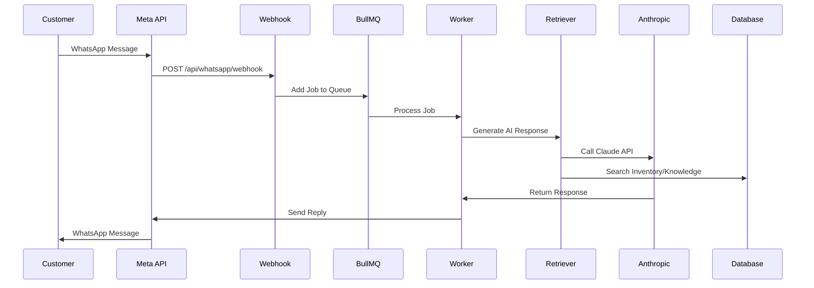

## Chatbot Overview

The KAIU AI chatbot provides automated customer support via WhatsApp using:
- **Claude 3 Haiku** for natural language understanding
- **Product inventory search** for real-time catalog queries
- **Knowledge base integration** for policy/FAQ responses
- **Human handover** for complex inquiries

<Info>
The chatbot is powered by LangChain + Anthropic and runs as a background worker using BullMQ.
</Info>

## Architecture

### Message Flow



### Components

**1. WhatsApp Queue** (`backend/whatsapp/queue.js`)
- Receives incoming messages from webhook
- Queues jobs for async processing
- Manages session state and history
- Handles handover to human agents

**2. AI Retriever** (`backend/services/ai/Retriever.js`)
- Orchestrates Claude API calls
- Executes tool calls (inventory search, knowledge base)
- Anti-hallucination safeguards
- Image sending via product IDs

**3. Session Management** (Database)
- Stores conversation history (last 10 messages)
- Tracks bot active/inactive state per phone number
- 24-hour session expiry
- PII redaction for privacy

## Configuration

### Environment Variables

```bash Required Credentials
ANTHROPIC_API_KEY=sk-ant-xxx         # Claude API key
WHATSAPP_PHONE_ID=123456789          # Meta phone ID
WHATSAPP_ACCESS_TOKEN=xxx            # Meta access token
REDIS_URL=redis://localhost:6379     # BullMQ queue storage
```

<Warning>
Never commit credentials to Git. Use `.env` files locally and environment variables in production.
</Warning>

### Redis Configuration

The queue requires Redis for job management:

```javascript Queue Connection (queue.js:18-30)
const redisUrl = process.env.REDIS_URL;
const redisOpts = { maxRetriesPerRequest: null };

if (!redisUrl) {
  redisOpts.host = process.env.REDIS_HOST || 'localhost';
  redisOpts.port = process.env.REDIS_PORT || 6379;
  redisOpts.password = process.env.REDIS_PASSWORD;
}

const queueConnection = redisUrl 
  ? new IORedis(redisUrl, redisOpts) 
  : new IORedis(redisOpts);
```

## Session Management

Each customer phone number gets a unique session:

<Steps>
  <Step title="Session Creation">
    On first message, creates session in database:
    
    ```javascript Create Session (queue.js:43-54)
    session = await prisma.whatsAppSession.create({
      data: { 
        phoneNumber: from, 
        isBotActive: true, 
        expiresAt: new Date(Date.now() + 24 * 60 * 60 * 1000),
        sessionContext: { history: [] } 
      }
    });
    ```
  </Step>
  
  <Step title="Bot Active Check">
    Before processing, verifies `isBotActive` flag:
    
    ```javascript
    if (!session.isBotActive) {
      console.log(`Bot inactive for ${from}. Skipping.`);
      return; // Human agent has taken over
    }
    ```
  </Step>
  
  <Step title="History Management">
    Maintains conversation context:
    
    ```javascript Keep Last 10 Messages (queue.js:82-83)
    history.push(userMsg);
    if (history.length > 10) history = history.slice(-10);
    ```
  </Step>
</Steps>

### PII Redaction

Sensitive info is redacted before storage:

```javascript Privacy Filter (queue.js:68)
const cleanText = redactPII(text);
const userMsg = { role: 'user', content: cleanText };
history.push(userMsg);
```

<Tip>
The `redactPII` function (from `utils/pii-filter.js`) removes phone numbers, emails, and ID numbers from context while keeping them in outbound messages.
</Tip>

## Human Handover

### Trigger Keywords

Automatic handover when customer says:

```javascript Handover Keywords (queue.js:86)
const HANDOVER_KEYWORDS = /\b(humano|agente|asesor|persona|queja|reclamo|ayuda|contactar|hablar con alguien)\b/i;
```

### Handover Process

<Steps>
  <Step title="Detect Keyword">
    Message matches handover regex.
  </Step>
  
  <Step title="Disable Bot">
    ```javascript
    await prisma.whatsAppSession.update({
      where: { id: session.id },
      data: { 
        isBotActive: false,
        handoverTrigger: "KEYWORD_DETECTED",
        sessionContext: { ...session.sessionContext, history }
      }
    });
    ```
  </Step>
  
  <Step title="Notify Customer">
    Sends handover message:
    
    ```javascript
    await axios.post(
      `https://graph.facebook.com/v21.0/${WHATSAPP_PHONE_ID}/messages`,
      {
        messaging_product: "whatsapp",
        to: from,
        text: { body: "Te estoy transfiriendo con un asesor humano. Un momento por favor." }
      }
    );
    ```
  </Step>
  
  <Step title="Stop AI Processing">
    Worker exits early, future messages wait for human agent.
  </Step>
</Steps>

<Note>
Socket.IO emits `session_update` event to notify admin dashboard of handover.
</Note>

## AI Tools Configuration

The chatbot uses Claude's native tool calling:

### Tool 1: Search Inventory

```javascript Tool Definition (Retriever.js:44-56)
{
  name: "searchInventory",
  description: "Busca en el inventario actual (catálogo de productos) de KAIU para responder preguntas sobre precios, disponibilidad, y variantes.",
  input_schema: {
    type: "object",
    properties: {
      query: {
        type: "string",
        description: "El nombre del producto, ingrediente o variante a buscar"
      }
    },
    required: ["query"]
  }
}
```

**Implementation:**

```javascript Execute Search (Retriever.js:74-104)
async function executeSearchInventory(query) {
  // Split query into terms
  const terms = query.split(' ').filter(w => w.length > 3);
  
  // Build OR search conditions
  const searchConditions = terms.map(t => ({
    OR: [
      { name: { contains: t, mode: 'insensitive' } },
      { category: { contains: t, mode: 'insensitive' } },
      { variantName: { contains: t, mode: 'insensitive' } }
    ]
  }));
  
  // Query Prisma
  const products = await prisma.product.findMany({
    where: { OR: searchConditions },
    select: { id, name, variantName, price, stock, isActive, category, description }
  });
  
  // Filter active only
  return JSON.stringify(products.filter(p => p.isActive));
}
```

### Tool 2: Search Knowledge Base

```javascript Tool Definition (Retriever.js:58-71)
{
  name: "searchKnowledgeBase",
  description: "Busca en el 'Cerebro RAG' manuales de la empresa, tiempos de envío, costos de envío a ciudades, y políticas generales.",
  input_schema: {
    type: "object",
    properties: {
      query: {
        type: "string",
        description: "La pregunta o concepto a buscar en la base de políticas"
      }
    },
    required: ["query"]
  }
}
```

<Warning>
Knowledge base search is currently disabled (OOM protection) and returns a placeholder. Re-enable by implementing vector search when RAM is available.
</Warning>

## Anti-Hallucination Safeguards

### System Prompt Rules

```javascript Strict Rules (Retriever.js:131-139)
const systemPrompt = `
REGLAS DE ORO:
1. NUNCA respondas sobre productos basándote en tu memoria. 
   SIEMPRE invoca "searchInventory" para CUALQUIER pregunta de producto.

2. PRECIOS están en PESOS COLOMBIANOS (COP). Usa "$" y formato amigable.

3. Si stock es 0, di que está agotado. NO ofrezcas alternativas que no existan.

4. IMÁGENES: Usa [SEND_IMAGE: id] con UUIDs reales de la herramienta.
   NUNCA inventes IDs falsos.
`;
```

### Forced Tool Calls

When customer asks for images, force database query:

```javascript Image Request Hook (Retriever.js:143-146)
let finalUserQuestion = userQuestion;
if (/(foto|imagen|ver|mostrar)/i.test(finalUserQuestion)) {
  finalUserQuestion += "\n[SISTEMA: Obligatorio ejecutar searchInventory para obtener UUIDs reales.]";
}
```

### Context Truncation

Prevent long-term memory hallucinations:

```javascript Limit History (Retriever.js:124-125)
// Keep only last 4 messages
const recentHistory = chatHistory.slice(-4);
```

## Image Sending Feature

Customers can request product images:

<Steps>
  <Step title="Customer Requests Image">
    "¿Tienes foto de la lavanda?"
  </Step>
  
  <Step title="AI Uses Tool">
    Calls `searchInventory("lavanda")` to get product UUID.
  </Step>
  
  <Step title="AI Response with Tag">
    Generates response:
    ```
    Sí, manejamos lavanda en 10ml por $50.000. [SEND_IMAGE: a1b2c3...]
    ```
  </Step>
  
  <Step title="Worker Extracts Image IDs">
    ```javascript Parse Tags (queue.js:121-129)
    const imageRegex = /\[SEND_IMAGE:\s*([^\]]+)\]/g;
    let match;
    const imageIds = [];
    
    while ((match = imageRegex.exec(finalText)) !== null) {
      imageIds.push(match[1]);
    }
    
    // Strip tags from display text
    finalText = finalText.replace(imageRegex, '').trim();
    ```
  </Step>
  
  <Step title="Fetch Image URLs">
    ```javascript Get Product Images (queue.js:136-145)
    for (const pid of imageIds) {
      const product = await prisma.product.findUnique({ 
        where: { id: pid.trim() } 
      });
      if (product && product.images && product.images.length > 0) {
        const rawUrl = product.images[0];
        const cleanUrl = rawUrl.startsWith('http') 
          ? rawUrl 
          : `${process.env.BASE_URL}${rawUrl}`;
        imageUrls.push(cleanUrl);
      }
    }
    ```
  </Step>
  
  <Step title="Send via WhatsApp API">
    ```javascript Send Images (queue.js:183-193)
    for (const cleanUrl of imageUrls) {
      await axios.post(
        `https://graph.facebook.com/v21.0/${WHATSAPP_PHONE_ID}/messages`,
        {
          messaging_product: "whatsapp",
          to: from,
          type: "image",
          image: { link: cleanUrl }
        }
      );
    }
    ```
  </Step>
</Steps>

<Tip>
Images are stored in history for reference: `aiMsg.images = imageUrls` (queue.js:149).
</Tip>

## Real-Time Dashboard Integration

The chatbot integrates with Socket.IO for live admin monitoring:

```javascript Socket Events (queue.js:53,74-80,101,154-158)
// New session created
io.emit('session_new', { id: session.id, phone: from, time: session.updatedAt });

// User message received
io.to(`session_${session.id}`).emit('new_message', { 
  sessionId: session.id, 
  message: { role: 'user', content: text, time: "Just now" } 
});

// Bot response sent
io.to(`session_${session.id}`).emit('new_message', { 
  sessionId: session.id, 
  message: { role: 'assistant', content: finalText, time: "Just now" } 
});

// Handover triggered
io.emit('session_update', { id: session.id, status: 'handover' });

// Update chat list
io.emit('chat_list_update', { sessionId: session.id });
```

<Note>
Admins can view live conversations in the admin dashboard by joining rooms: `socket.join(session_${sessionId})`.
</Note>

## Best Practices

<CardGroup cols={2}>
  <Card title="Monitor Token Usage" icon="coins">
    Claude Haiku is cost-effective but track API usage. Context truncation keeps costs low.
  </Card>
  
  <Card title="Update System Prompt" icon="file-pen">
    Regularly refine the system prompt based on common mistakes or new product categories.
  </Card>
  
  <Card title="Test Handover Flow" icon="hand">
    Ensure handover triggers work and admin dashboard notifications are received.
  </Card>
  
  <Card title="Review Conversations" icon="messages">
    Use Socket.IO dashboard to review bot accuracy and identify training opportunities.
  </Card>
</CardGroup>

## Troubleshooting

### Bot Not Responding

**Symptom**: Customer messages received but no reply.

**Solutions**:
- Check BullMQ worker is running
- Verify Redis connection
- Check `ANTHROPIC_API_KEY` is valid
- Review worker logs for errors

### Wrong Product Info

**Symptom**: Bot gives incorrect prices or availability.

**Solutions**:
- Verify inventory database is up to date
- Check `searchInventory` query logic
- Ensure products are marked `isActive: true`
- Force tool call by mentioning product name explicitly

### Images Not Sending

**Symptom**: `[SEND_IMAGE]` tag in response but no image.

**Solutions**:
- Verify product has valid image URL
- Check image URL is publicly accessible
- Ensure Meta API has permission to fetch image
- Test image URL in browser

### Session Not Expiring

**Symptom**: Old sessions remain active.

**Solutions**:
- Check `expiresAt` is being set (24 hours)
- Implement cleanup job to delete expired sessions
- Add session expiry check before processing messages

## Next Steps

<CardGroup cols={2}>
  <Card title="Knowledge Base" icon="book" href="/guides/knowledge-base">
    Learn how to add FAQ and policy documents
  </Card>
  
  <Card title="Admin Portal" icon="shield-check" href="/guides/admin-portal">
    Monitor conversations in real-time
  </Card>
</CardGroup>