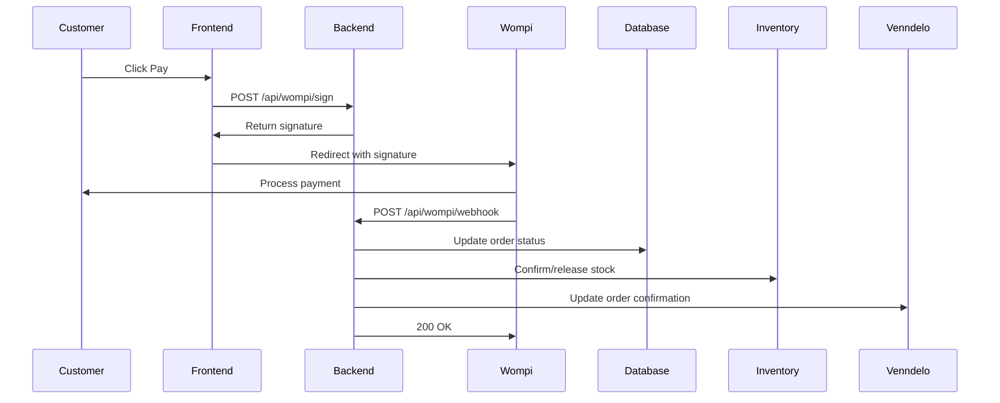

## Payment System Overview

KAIU uses **Wompi** (Colombian payment gateway) for online payments via:
- Credit/debit cards (Visa, Mastercard, Amex)
- PSE (bank transfers)
- Nequi (mobile wallet)

**Cash on Delivery (COD)** is also supported for select cities.

<Info>
Wompi webhooks automatically confirm/reject orders based on payment status.
</Info>

## Architecture

### Payment Flow



## Configuration

### Environment Variables

```bash Required Credentials
WOMPI_PUBLIC_KEY=pub_prod_xxx           # Frontend public key
WOMPI_INTEGRITY_SECRET=prod_integrity_xxx  # Webhook signature secret
BASE_URL=https://api.kaiu.com.co        # Your backend URL
```

<Warning>
Never expose `WOMPI_INTEGRITY_SECRET` in frontend code. Only use `WOMPI_PUBLIC_KEY` client-side.
</Warning>

### Wompi Dashboard Setup

<Steps>
  <Step title="Create Wompi Account">
    Sign up at [wompi.com](https://wompi.com) and complete merchant verification.
  </Step>
  
  <Step title="Get API Keys">
    Navigate to **Settings → API Keys**:
    - Copy **Public Key** for frontend
    - Copy **Integrity Secret** for webhook validation
  </Step>
  
  <Step title="Configure Webhook URL">
    In Wompi dashboard, set webhook URL:
    ```
    https://api.kaiu.com.co/api/wompi/webhook
    ```
    
    Select events: `transaction.updated`
  </Step>
  
  <Step title="Test Mode">
    Use test credentials initially:
    ```bash
    WOMPI_PUBLIC_KEY=pub_test_xxx
    WOMPI_INTEGRITY_SECRET=test_integrity_xxx
    ```
    
    Switch to production keys when ready to go live.
  </Step>
</Steps>

## Transaction Signature

Wompi requires a SHA256 signature to prevent tampering:

### Signature Endpoint

**POST /api/wompi/sign**

```javascript Request
fetch('/api/wompi/sign', {
  method: 'POST',
  headers: { 'Content-Type': 'application/json' },
  body: JSON.stringify({
    reference: 'KAIU-12345',      // Order ID
    amount: 4500000,               // Amount in cents (45000.00 COP)
    currency: 'COP'
  })
})
```

```json Response
{
  "signature": "a1b2c3d4e5f6...",
  "reference": "KAIU-12345"
}
```

**Implementation:**

```javascript Sign Endpoint (sign.js:19-44)
const { reference, amount, currency } = req.body;
const integritySecret = process.env.WOMPI_INTEGRITY_SECRET;

if (!reference || !amount || !currency) {
  return res.status(400).json({ error: 'Missing parameters' });
}

// Formula: SHA256(Reference + AmountInCents + Currency + Secret)
const rawString = `${reference}${amount}${currency}${integritySecret}`;
const signature = crypto.createHash('sha256').update(rawString).digest('hex');

return res.status(200).json({ signature, reference });
```

<Tip>
Amount must be in cents (multiply by 100): $450.00 → 45000 cents.
</Tip>

## Frontend Integration

In your checkout page:

```javascript Checkout.tsx Example
import { useEffect } from 'react';

function Checkout({ order }) {
  useEffect(() => {
    // 1. Get signature from backend
    const getSignature = async () => {
      const res = await fetch('/api/wompi/sign', {
        method: 'POST',
        headers: { 'Content-Type': 'application/json' },
        body: JSON.stringify({
          reference: `KAIU-${order.readableId}`,
          amount: Math.round(order.total * 100), // Convert to cents
          currency: 'COP'
        })
      });
      const data = await res.json();
      return data.signature;
    };
    
    // 2. Load Wompi widget
    const loadWompi = async () => {
      const signature = await getSignature();
      
      const script = document.createElement('script');
      script.src = 'https://checkout.wompi.co/widget.js';
      script.setAttribute('data-render', 'payment-form');
      script.setAttribute('data-public-key', import.meta.env.VITE_WOMPI_PUBLIC_KEY);
      script.setAttribute('data-currency', 'COP');
      script.setAttribute('data-amount-in-cents', Math.round(order.total * 100));
      script.setAttribute('data-reference', `KAIU-${order.readableId}`);
      script.setAttribute('data-signature:integrity', signature);
      script.setAttribute('data-redirect-url', `${window.location.origin}/order-confirmation`);
      
      document.body.appendChild(script);
    };
    
    loadWompi();
  }, [order]);
  
  return <div id="payment-form"></div>;
}
```

<Note>
Wompi widget auto-renders in the element with `id="payment-form"`. Customize styles via data attributes.
</Note>

## Webhook Processing

Wompi sends POST requests to your webhook URL when transactions update:

### Webhook Payload

```json Wompi Webhook Body
{
  "data": {
    "transaction": {
      "id": "1234-5678-9012",
      "reference": "KAIU-12345",
      "amount_in_cents": 4500000,
      "status": "APPROVED",
      "payment_method_type": "CARD",
      "payment_method": {
        "type": "CARD",
        "extra": {
          "bin": "424242",
          "last_four": "4242"
        }
      }
    }
  },
  "signature": {
    "checksum": "abc123..."
  },
  "timestamp": 1709553600
}
```

### Webhook Handler

**POST /api/wompi/webhook**

```javascript Webhook Handler (webhook.js:11-54)
export default async function wompiWebhookHandler(req, res) {
  const { data, signature, timestamp } = req.body;
  const { id, reference, amount_in_cents, status } = data.transaction;
  
  // 1. Verify Integrity
  const secret = process.env.WOMPI_INTEGRITY_SECRET;
  const integrityString = `${id}${status}${amount_in_cents}${timestamp}${secret}`;
  const generatedSignature = crypto.createHash('sha256')
    .update(integrityString)
    .digest('hex');
  
  if (generatedSignature !== signature.checksum) {
    return res.status(400).json({ error: "Integrity failed" });
  }
  
  // 2. Respond immediately (Wompi expects fast 200 OK)
  res.status(200).json({ success: true });
  
  // 3. Process asynchronously
  processOrderAsync(req.body).catch(err => {
    console.error("Critical: Error processing order", err);
  });
}
```

<Warning>
Always respond with 200 OK within 3 seconds. Process order updates async to avoid timeouts.
</Warning>

### Order Processing Logic

```javascript Process Order (webhook.js:59-140)
async function processOrderAsync(body) {
  const { reference, status } = body.data.transaction;
  const pinStr = reference.split('-')[1]; // "KAIU-12345" → "12345"
  const pin = parseInt(pinStr, 10);
  
  // Find order in database
  let dbOrder = await prisma.order.findFirst({
    where: { readableId: pin },
    include: { items: true }
  });
  
  if (!dbOrder) {
    console.warn(`Order not found: ${reference}`);
    return;
  }
  
  const venndeloId = dbOrder.externalId || pinStr;
  
  if (status === 'APPROVED') {
    console.log("Payment APPROVED → Confirming order");
    
    // 1. Update Venndelo status
    await fetch(`https://api.venndelo.com/v1/admin/orders/${venndeloId}/modify-order-confirmation-status`, {
      method: 'POST',
      headers: { 
        'Content-Type': 'application/json',
        'X-Venndelo-Api-Key': process.env.VENNDELO_API_KEY 
      },
      body: JSON.stringify({ confirmation_status: 'CONFIRMED' })
    });
    
    // 2. Update local database
    await prisma.order.update({
      where: { id: dbOrder.id },
      data: { status: 'CONFIRMED' }
    });
    
    // 3. Confirm inventory sale
    await InventoryService.confirmSale(dbOrder.items);
    
  } else if (['DECLINED', 'VOIDED', 'ERROR'].includes(status)) {
    console.log(`Payment ${status} → Cancelling order`);
    
    // 1. Update Venndelo
    await fetch(`https://api.venndelo.com/v1/admin/orders/${venndeloId}/modify-order-confirmation-status`, {
      method: 'POST',
      body: JSON.stringify({ confirmation_status: 'REJECTED' })
    });
    
    // 2. Cancel in database
    await prisma.order.update({
      where: { id: dbOrder.id },
      data: { status: 'CANCELLED' }
    });
    
    // 3. Release inventory
    await InventoryService.releaseReserve(dbOrder.items);
  }
}
```

## Payment Statuses

| Wompi Status | Meaning | Action Taken |
|--------------|---------|-------------|
| **APPROVED** | Payment successful | Confirm order, deduct inventory |
| **DECLINED** | Card declined | Cancel order, release inventory |
| **VOIDED** | Transaction voided | Cancel order, release inventory |
| **ERROR** | Processing error | Cancel order, release inventory |
| **PENDING** | Awaiting confirmation (PSE) | No action, wait for update |

<Note>
PSE (bank transfer) payments show PENDING initially, then update to APPROVED/DECLINED after 1-3 minutes.
</Note>

## Inventory Synchronization

Webhook updates trigger inventory changes:

### On APPROVED

```javascript Confirm Sale (webhook.js:122)
await InventoryService.confirmSale(dbOrder.items);
```

This:
1. Converts reserved stock to confirmed sale
2. Decrements `product.stock` permanently
3. Records sale in analytics

### On DECLINED/ERROR

```javascript Release Reserve (webhook.js:137)
await InventoryService.releaseReserve(dbOrder.items);
```

This:
1. Returns reserved stock to available pool
2. Allows other customers to purchase
3. Prevents overselling

## Testing Webhooks Locally

### Using ngrok

<Steps>
  <Step title="Install ngrok">
    ```bash
    npm install -g ngrok
    ```
  </Step>
  
  <Step title="Expose Local Server">
    ```bash
    ngrok http 3001
    ```
    
    Note the HTTPS URL: `https://abc123.ngrok.io`
  </Step>
  
  <Step title="Update Wompi Webhook">
    In Wompi dashboard, set webhook to:
    ```
    https://abc123.ngrok.io/api/wompi/webhook
    ```
  </Step>
  
  <Step title="Test Payment">
    Use Wompi test cards:
    - **Approved**: 4242 4242 4242 4242
    - **Declined**: 4000 0000 0000 0002
    
    Any future expiry, any CVV.
  </Step>
  
  <Step title="Monitor Logs">
    Watch console for webhook POST and order processing logs.
  </Step>
</Steps>

<Tip>
Use [webhook.site](https://webhook.site) to inspect raw Wompi payloads before coding your handler.
</Tip>

## COD (Contra Entrega) Setup

For cash on delivery orders:

### Frontend Detection

```javascript Checkout.tsx
if (paymentMethod === 'COD') {
  // Skip Wompi widget
  // Create order with paymentMethod: 'COD'
  const order = await createOrder({ ...orderData, paymentMethod: 'COD' });
  
  // Order starts as PENDING
  // Admin manually confirms after delivery
}
```

### Order Status Flow

1. **PENDING**: Order created, awaiting admin confirmation
2. **CONFIRMED**: Admin verifies address and confirms (manual)
3. **READY_TO_SHIP**: Label generated
4. **SHIPPED**: Package with carrier
5. **DELIVERED**: Carrier confirms delivery + payment collected

<Note>
COD orders don't trigger webhooks. Inventory is reserved on creation, confirmed when admin manually updates status.
</Note>

## Best Practices

<CardGroup cols={2}>
  <Card title="Signature Security" icon="shield">
    Rotate `WOMPI_INTEGRITY_SECRET` quarterly. Update in Wompi dashboard and environment variables.
  </Card>
  
  <Card title="Idempotency" icon="arrows-rotate">
    Wompi may send duplicate webhooks. Use transaction ID to prevent duplicate processing.
  </Card>
  
  <Card title="Webhook Retry" icon="repeat">
    If your webhook returns non-200, Wompi retries up to 10 times. Log duplicate prevention.
  </Card>
  
  <Card title="Monitor Failures" icon="chart-line">
    Set up alerts for declined transactions. High decline rate may indicate fraud or UX issues.
  </Card>
</CardGroup>

## Troubleshooting

### Webhook Not Received

**Symptom**: Payment completes but order not updated.

**Solutions**:
- Verify webhook URL in Wompi dashboard
- Check firewall allows Wompi IPs
- Ensure HTTPS (Wompi requires TLS)
- Review server logs for incoming POST requests
- Test with ngrok to rule out network issues

### Signature Validation Fails

**Symptom**: Webhook returns 400 "Integrity failed".

**Solutions**:
- Verify `WOMPI_INTEGRITY_SECRET` matches dashboard
- Check timestamp is not too old (5 min tolerance)
- Log generated vs. received signatures to compare
- Ensure amount_in_cents is exact (no rounding errors)

### Order Not Confirmed

**Symptom**: Webhook received but order stays PENDING.

**Solutions**:
- Check `reference` format matches `KAIU-{readableId}`
- Verify order exists in database before webhook
- Review async processing logs for errors
- Ensure Venndelo API key is valid

### Inventory Not Updated

**Symptom**: Order confirmed but stock unchanged.

**Solutions**:
- Check `InventoryService.confirmSale()` implementation
- Verify order.items includes product IDs
- Review database transaction logs
- Test inventory service independently

## Next Steps

<CardGroup cols={2}>
  <Card title="Order Fulfillment" icon="truck" href="/guides/order-fulfillment">
    Process confirmed orders and generate shipping labels
  </Card>
  
  <Card title="Admin Portal" icon="shield-check" href="/guides/admin-portal">
    Monitor payments and order statuses
  </Card>
</CardGroup>