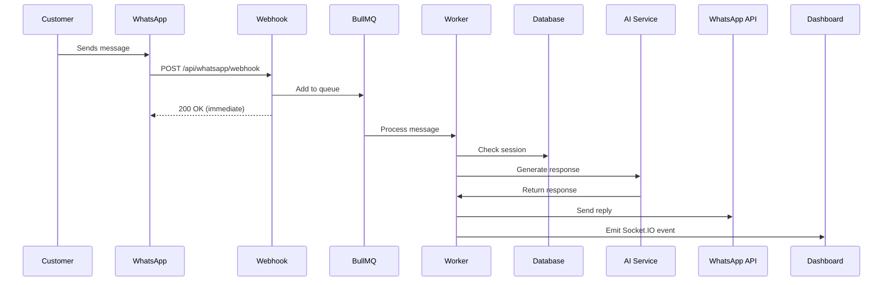

## Overview

KAIU Natural Living integrates with **WhatsApp Cloud API** to provide automated customer support powered by Anthropic Claude AI. The system handles:

- Automated product inquiries and recommendations
- Intelligent handover to human agents
- Session management with conversation history
- PII filtering for privacy compliance
- Real-time dashboard notifications

## Architecture



## Prerequisites

- Meta Business Account
- Facebook App with WhatsApp product
- Public HTTPS URL for webhook (use ngrok for development)
- Phone number verified with Meta

## Setup Steps

<Steps>
  <Step title="Create Meta App">
    <Steps>
      <Step title="Go to Meta Developers">
        Navigate to [Meta for Developers](https://developers.facebook.com) and log in.
      </Step>
      <Step title="Create App">
        1. Click **Create App**
        2. Select **Business** as app type
        3. Fill in app details and create
      </Step>
      <Step title="Add WhatsApp Product">
        1. In your app dashboard, click **Add Product**
        2. Find **WhatsApp** and click **Set Up**
      </Step>
    </Steps>
  </Step>

  <Step title="Get API Credentials">
    From the WhatsApp > API Setup page, collect:

    ### Phone Number ID
    ```bash
    WHATSAPP_PHONE_ID="123456789012345"
    ```
    Found under **"Phone number ID"** in the API Setup tab.

    ### Access Token
    ```bash
    WHATSAPP_ACCESS_TOKEN="EAAG..."
    ```

    <Warning>
      The temporary token expires in 24 hours. For production, generate a permanent **System User Token**.
    </Warning>

    **To create a permanent token:**
    1. Go to **Business Settings > System Users**
    2. Create a system user
    3. Assign WhatsApp permissions
    4. Generate token (never expires)

    ### App Secret
    ```bash
    WHATSAPP_APP_SECRET="your-app-secret-from-settings"
    ```
    Found under **Settings > Basic** in your Meta App dashboard.
  </Step>

  <Step title="Configure Webhook">
    <Warning>
      Webhooks require a public HTTPS URL. For local development, use ngrok or similar tunneling service.
    </Warning>

    ### Set Up Tunnel (Development)
    ```bash
    # Install ngrok
    npm install -g ngrok

    # Start your API server
    npm run api:dev

    # In another terminal, create tunnel
    ngrok http 3001
    ```

    Copy the HTTPS URL (e.g., `https://abc123.ngrok.io`).

    ### Create Verify Token
    Generate a random string for webhook verification:

    ```bash
    # Generate secure token
    node -e "console.log(require('crypto').randomBytes(16).toString('hex'))"
    ```

    Add to `.env.local`:
    ```bash
    WHATSAPP_VERIFY_TOKEN="your-generated-token-here"
    ```

    ### Register Webhook in Meta
    1. Go to **WhatsApp > Configuration** in Meta App dashboard
    2. Click **Edit** next to Webhook
    3. Enter:
       - **Callback URL**: `https://your-domain.com/api/whatsapp/webhook`
       - **Verify Token**: The token you generated above
    4. Click **Verify and Save**

    <Info>
      The webhook handler in `backend/whatsapp/webhook.js:52-68` validates this token.
    </Info>

    ### Subscribe to Messages
    1. In the Webhook section, click **Manage**
    2. Subscribe to **messages** webhook field
    3. Click **Save**
  </Step>

  <Step title="Configure Environment Variables">
    Add all WhatsApp credentials to `.env.local`:

    ```bash .env.local
    # WhatsApp Cloud API Configuration
    WHATSAPP_PHONE_ID="123456789012345"
    WHATSAPP_ACCESS_TOKEN="EAAG..."
    WHATSAPP_VERIFY_TOKEN="your-custom-verify-token"
    WHATSAPP_APP_SECRET="abcdef1234567890"

    # Optional: Base URL for image links
    BASE_URL="https://your-domain.com"
    ```
  </Step>

  <Step title="Test Webhook">
    ### Test Verification
    ```bash
    curl "http://localhost:3001/api/whatsapp/webhook?hub.mode=subscribe&hub.verify_token=your-verify-token&hub.challenge=CHALLENGE_ACCEPTED"
    ```

    Should return: `CHALLENGE_ACCEPTED`

    ### Send Test Message
    1. Go to **WhatsApp > API Setup** in Meta dashboard
    2. Send a test message to your phone
    3. Reply to the message
    4. Check server logs for:
       ```
       📥 Queued message from 573001234567: wamid.xxx
       ⚙️ Processing Job: wamid.xxx - Hola
       ✅ Job Completed: wamid.xxx
       ```
  </Step>
</Steps>

## Implementation Details

### Webhook Handler

The webhook is implemented in `backend/whatsapp/webhook.js`:

```javascript
// GET - Verification Request from Meta
router.get('/webhook', (req, res) => {
  const mode = req.query['hub.mode'];
  const token = req.query['hub.verify_token'];
  const challenge = req.query['hub.challenge'];

  if (mode === 'subscribe' && token === VERIFY_TOKEN) {
    console.log("✅ Webhook Verified!");
    res.status(200).send(challenge);
  } else {
    res.sendStatus(403);
  }
});

// POST - Incoming Messages
router.post('/webhook', validateSignature, async (req, res) => {
  // IMMEDIATE 200 OK
  res.sendStatus(200);

  const message = req.body.entry?.[0]?.changes?.[0]?.value?.messages?.[0];
  
  if (message && message.type === 'text') {
    await whatsappQueue.add('process-message', {
      wamid: message.id,
      from: message.from,
      text: message.text.body,
      timestamp: message.timestamp
    }, {
      jobId: message.id, // Deduplication
      removeOnComplete: true
    });
  }
});
```

### Signature Validation

<Info>
  Meta signs all webhook requests with `X-Hub-Signature-256` header for security.
</Info>

```javascript backend/whatsapp/webhook.js:12-49
function validateSignature(req, res, next) {
  const signature = req.headers['x-hub-signature-256'];
  
  if (APP_SECRET && signature) {
    const signatureHash = signature.split('=')[1];
    const payload = req.rawBody || JSON.stringify(req.body);
    
    const expectedHash = crypto.createHmac('sha256', APP_SECRET)
                               .update(payload)
                               .digest('hex');

    if (signatureHash !== expectedHash) {
      console.error("❌ Invalid Signature");
      // return res.status(403).send("Invalid Signature");
    }
  }
  
  next();
}
```

<Warning>
  Ensure `express.json()` is configured with `verify` option in `server.mjs:61-65` to capture raw body for signature validation.
</Warning>

### Message Processing

Messages are processed asynchronously by the BullMQ worker in `backend/whatsapp/queue.js:35-201`:

```javascript
export const worker = new Worker('whatsapp-ai', async job => {
  const { wamid, from, text } = job.data;
  
  // 1. Check/Create Session
  let session = await prisma.whatsAppSession.findUnique({ 
    where: { phoneNumber: from } 
  });
  
  if (!session) {
    session = await prisma.whatsAppSession.create({
      data: { 
        phoneNumber: from, 
        isBotActive: true, 
        expiresAt: new Date(Date.now() + 24 * 60 * 60 * 1000),
        sessionContext: { history: [] } 
      }
    });
  }

  // 2. Check if Bot is Active
  if (!session.isBotActive) {
    console.log(`⏸️ Bot inactive for ${from}. Skipping.`);
    return;
  }

  // 3. Handover Detection
  const HANDOVER_KEYWORDS = /\b(humano|agente|asesor|persona|queja|reclamo)\b/i;
  if (HANDOVER_KEYWORDS.test(text)) {
    await prisma.whatsAppSession.update({
      where: { id: session.id },
      data: { 
        isBotActive: false,
        handoverTrigger: "KEYWORD_DETECTED"
      }
    });
    
    // Send transfer message
    await axios.post(
      `https://graph.facebook.com/v21.0/${process.env.WHATSAPP_PHONE_ID}/messages`,
      {
        messaging_product: "whatsapp",
        to: from,
        text: { body: "Te estoy transfiriendo con un asesor humano..." }
      },
      { headers: { 
        'Authorization': `Bearer ${process.env.WHATSAPP_ACCESS_TOKEN}` 
      }}
    );
    return;
  }

  // 4. AI Processing
  const aiResponse = await generateSupportResponse(text, history);
  
  // 5. Send Response
  await axios.post(
    `https://graph.facebook.com/v21.0/${process.env.WHATSAPP_PHONE_ID}/messages`,
    {
      messaging_product: "whatsapp",
      to: from,
      text: { body: aiResponse.text }
    },
    { headers: { 'Authorization': `Bearer ${process.env.WHATSAPP_ACCESS_TOKEN}` }}
  );
});
```

## Features

### Intelligent Handover

The system automatically transfers to human agents when it detects keywords:

```javascript backend/whatsapp/queue.js:86
const HANDOVER_KEYWORDS = /\b(humano|agente|asesor|persona|queja|reclamo|ayuda|contactar|hablar con alguien)\b/i;
```

<Info>
  Customize handover keywords in `backend/whatsapp/queue.js:86` to match your language and business needs.
</Info>

### PII Filtering

Personally Identifiable Information is redacted before storing in conversation history:

```javascript backend/utils/pii-filter.js
export function redactPII(text) {
  return text
    .replace(/\b[\w.-]+@[\w.-]+\.\w{2,}\b/g, '[EMAIL_REDACTED]')
    .replace(/\b\d{3}[-.\s]?\d{3}[-.\s]?\d{4}\b/g, '[PHONE_REDACTED]');
}
```

### Session Management

Sessions expire after 24 hours (Meta's conversation window):

```javascript
expiresAt: new Date(Date.now() + 24 * 60 * 60 * 1000)
```

### Real-time Dashboard Updates

Socket.IO events notify the dashboard of new messages:

```javascript backend/whatsapp/queue.js:74-80
if (io) {
  io.to(`session_${session.id}`).emit('new_message', { 
    sessionId: session.id, 
    message: { role: 'user', content: text, time: "Just now" } 
  });
  io.emit('chat_list_update', { sessionId: session.id });
}
```

## Testing

<Steps>
  <Step title="Test Webhook Locally">
    ```bash
    # Start server
    npm run api:dev

    # Start ngrok
    ngrok http 3001

    # Update webhook URL in Meta dashboard
    # Send test message from Meta API Setup page
    ```
  </Step>
  <Step title="Mock Webhook Request">
    ```bash
    curl -X POST http://localhost:3001/api/whatsapp/webhook \
      -H "Content-Type: application/json" \
      -d '{
        "object": "whatsapp_business_account",
        "entry": [{
          "changes": [{
            "value": {
              "messages": [{
                "id": "wamid.test123",
                "from": "573001234567",
                "timestamp": "1234567890",
                "type": "text",
                "text": { "body": "¿Tienen aceite de lavanda?" }
              }]
            }
          }]
        }]
      }'
    ```
  </Step>
  <Step title="Check Logs">
    You should see:
    ```
    📥 Queued message from 573001234567: wamid.test123
    ⚙️ Processing Job: wamid.test123 - ¿Tienen aceite de lavanda?
    🤖 Processing question via Agent: "¿Tienen aceite de lavanda?"
    🛠️ Executing Tool: searchInventory with query: "lavanda"
    ✅ Job Completed: wamid.test123
    ```
  </Step>
</Steps>

## Production Deployment

<CardGroup cols={2}>
  <Card title="Permanent Token" icon="key">
    Create a System User token in Meta Business Settings that never expires
  </Card>
  <Card title="HTTPS Required" icon="lock">
    Meta requires HTTPS for webhook URLs. Use Let's Encrypt or your hosting provider's SSL
  </Card>
  <Card title="Monitor Rate Limits" icon="gauge">
    WhatsApp Cloud API has rate limits. Configure BullMQ limiter accordingly
  </Card>
  <Card title="Backup Strategy" icon="database">
    Session data and conversation history are stored in PostgreSQL for recovery
  </Card>
</CardGroup>

### Environment Variables for Production

```bash
# Use permanent System User token
WHATSAPP_ACCESS_TOKEN="EAAG...(permanent)"

# Production phone number
WHATSAPP_PHONE_ID="your-production-phone-id"

# Secure verify token
WHATSAPP_VERIFY_TOKEN="$(openssl rand -hex 32)"

# App secret from Meta dashboard
WHATSAPP_APP_SECRET="your-production-app-secret"

# Production API URL
BASE_URL="https://api.kaiu.com"
```

## Troubleshooting

<AccordionGroup>
  <Accordion title="Webhook Verification Fails">
    **Error**: `403 Forbidden` when setting up webhook

    **Solution**:
    1. Check `WHATSAPP_VERIFY_TOKEN` matches exactly in both Meta dashboard and `.env.local`
    2. Ensure webhook URL is accessible: `curl https://your-url/api/whatsapp/webhook`
    3. Check server logs for verification attempt
  </Accordion>

  <Accordion title="Messages Not Received">
    **Error**: Webhook registered but no messages arrive

    **Solution**:
    1. Check webhook subscriptions include "messages" field
    2. Verify phone number is added to WhatsApp Business Account
    3. Test webhook manually with curl
    4. Check ngrok is still running (URLs change on restart)
  </Accordion>

  <Accordion title="Signature Validation Errors">
    **Error**: `Invalid Signature` in logs

    **Solution**:
    1. Verify `WHATSAPP_APP_SECRET` is correct
    2. Ensure `express.json()` includes `verify` callback in `server.mjs:61`:
       ```javascript
       app.use(express.json({
         verify: (req, res, buf) => { req.rawBody = buf; }
       }));
       ```
    3. Check `X-Hub-Signature-256` header is present in request
  </Accordion>

  <Accordion title="AI Responses Not Sending">
    **Error**: Jobs complete but customer doesn't receive reply

    **Solution**:
    1. Check `WHATSAPP_ACCESS_TOKEN` is valid and not expired
    2. Verify `WHATSAPP_PHONE_ID` is correct
    3. Check rate limits: `curl https://graph.facebook.com/v21.0/me -H "Authorization: Bearer $TOKEN"`
    4. Review API response in worker logs for error details
  </Accordion>

  <Accordion title="Handover Not Working">
    **Error**: Bot continues responding after customer requests human

    **Solution**:
    1. Check handover keywords match your language in `queue.js:86`
    2. Verify session `isBotActive` is set to `false` in database
    3. Ensure dashboard is receiving Socket.IO events
    4. Test with exact keyword: "quiero hablar con un humano"
  </Accordion>
</AccordionGroup>

## Next Steps

<CardGroup cols={2}>
  <Card title="AI Configuration" icon="brain" href="/ai/rag-setup">
    Configure RAG and knowledge base for intelligent responses
  </Card>
  <Card title="Dashboard" icon="chart-line" href="/dashboard/overview">
    Monitor conversations and manage handovers
  </Card>
</CardGroup>